# Fluid

**A desktop AI agent platform built to answer the questions every "AI agents" demo dodges: how do you know they're any good, how do you stop them lying, what does it cost when you swap the model, and what happens when they fail at 2 AM.**

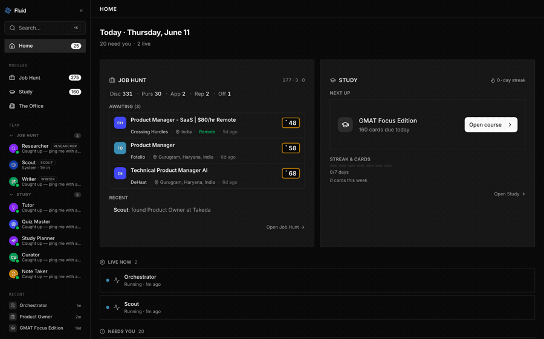

A Product Manager's portfolio project by [Christin Thomas](https://www.linkedin.com/in/0chris). Built to ship the unglamorous parts of agentic AI for real — evaluation, truth-grounding, model selection, reliability — and to prove the platform thesis by reusing the same shell for a second domain.

> Updated June 2026. The code is private; this page is a living overview of what's built and where the interesting decisions were.

---

## TL;DR

- **Three live modules on one runtime.** **Job Hunt** (3 agents covering a 5-stage pipeline), **Study** (5 agents — 4 student-facing plus a background Curator — FSRS-6 spaced repetition, sync sessions and async Deep Dive), and **Product Studio** (a 7-agent product team that takes one idea to a shipped, working web app — with browser-based QA that actually runs what was built). Same orchestration layer, same eval harness, same guardrails — different domains.
- **Built for trust, not demos.** A deterministic truth-grounding verifier blocks fabricated claims before they leave the app — on the screenshot below it clears 42 of 43 claims and correctly classifies the 43rd as an *honest gap*, not a lie. An evaluation harness scores every agent against per-role rubrics, with separate **graded** and **guardrail** (pass/fail) dimensions and N-iteration averaging so a lucky single run can't mask flaky behaviour.
- **Model choice is an experiment, not a vibe.** A **Model A/B Lab** runs N `{provider, model}` candidates head-to-head against the incumbent on a fixed rubric, with a coverage-aware fairness contract, per-model cost + latency, and a one-click apply/revert of the winner. The first comparison kept Researcher on MiniMax-M2.7 over Hermes-3-405B on a measured 15-point edge.
- **Hardened the way real products are.** After the first feature push I paused and gated new work behind a multi-sprint stabilization plan, then kept the discipline: **135 issues tracked, 89 fixed, every High- and Critical-severity defect closed** — atomic counters, optimistic concurrency, FIFO locks, SSRF guards, recovery hygiene, an OS-level timeout backstop that survives a starved event loop, and an observability layer over the agent runtime I don't own.

Most of what this README is about is *what changed because of what broke, and how I measure whether it's any good*. The agents are table stakes.

---

## What it is

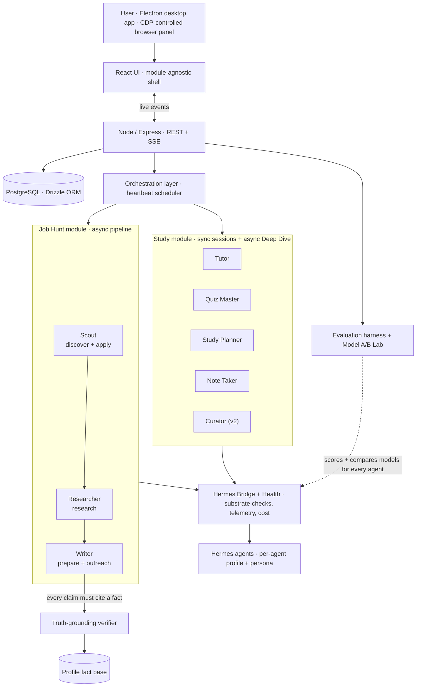

Two distinct execution paths sit underneath the same UI shell, which was a real design choice rather than an accident:

- **Async / heartbeat path** — Job Hunt, Meetings, Study content import and Deep Dive, Study Curator. Work becomes a tracked issue; a heartbeat scheduler wakes the right agent; a bridge service lenient-parses the agent's output back into domain tables. This is where the truth verifier runs.
- **Sync path** — Study Tutor sessions and Quiz Me. An awaited Hermes turn through a concurrency semaphore: no issue, no scheduler, no bridge. The student is sitting in front of the conversation; latency is the product.

Keeping these explicitly separate — rather than forcing one path to serve both — was the architectural decision that made Study tractable on the Job Hunt shell.

---

## The six decisions that actually defined the product

### 1. Approval gates instead of full autonomy

The agents are perfectly capable of running an opportunity end-to-end without me. I deliberately broke the pipeline into reviewable artifacts at every stage. The asymmetry is the point: a generic cover letter sent to a company I'd never work for costs me a real foot in a real door; a 30-second review costs almost nothing. Every stage emits a versioned artifact — research dossier, tailored resume bullets, outreach draft, application checklist — and I approve before the next stage starts.

This is what most "autonomous agent" demos get wrong. Autonomy is not the goal. Reviewable, interruptible, reversible work *is*.

### 2. Match-scoring with explicit hard-rule caps

Early Scout outputs were too forgiving — a 78/100 on a role that required 10+ years when I have 6. I rewrote the rubric so the model can't be polite past structural mismatch:

- Deal-breaker keyword present → score caps at **30**
- Below minimum salary floor → caps at **50**
- Missing all "must-include" themes (AI / Growth / Platform) → caps at **40**
- Seniority mismatch → caps at **60**

And the cap must be articulated in the rationale, in one line, ≤ 150 chars. The triage workflow went from "open every JD" to "scan score + one-line cap, decide the borderlines in 90 seconds." This is the unsexy work of making a model's output decision-grade.

### 3. Roles and boundaries instead of one super-agent

The first version had a single "CEO" agent that handled everything. Given a task to enrich job descriptions from LinkedIn URLs, it tried to do it itself instead of delegating to the browser-capable agent. Adding *organizational* structure — not a bigger model — fixed it: each agent has an explicit scope, an explicit toolset, an explicit list of what it should NOT do, and (for the orchestrator) a delegation rule book. Clear lanes in agents are the same problem as clear lanes in a real team.

A direct consequence: when I added the Study module, "what roles, with what boundaries" was the design question I already knew how to answer.

### 4. Truth-grounding as a deterministic guardrail

Every concrete claim a Job Hunt writer agent emits — a metric, a scope, an achievement — must trace to a **cite-keyed fact** in a profile fact base extracted from my real resume plus an uploaded long-form career doc. A mechanical verifier walks the output, matches each claim against the fact base, and flags anything that doesn't trace. Deterministic by design: fast, explainable, impossible to fool with confident prose.

Two things I learned the hard way and fixed:
- The bridge originally deduped outputs by `(opportunity, stage, agent)`, which meant a re-run of the same stage silently kept the *older* output. The dedup is now **time-aware**: an output only counts as "this issue's" if its `createdAt >= issue.startedAt`. Spent half a day on a verifier showing 0 of N matches before I found this.
- Honest gaps were being flagged as fabrications. Added a third claim category — **`acknowledged_gap`** — so "I don't have direct fintech experience, but…" is recognized as candor, not a lie. Surface area for the model to be honest matters as much as surface area to catch dishonesty. (You can see this live on the verifier screenshot below: 42 grounded, 1 honest gap, 0 fabrications.)

### 5. Cross-opportunity learning loop

Most AI products are static — each interaction is independent. Fluid captures every score override, rationale rewrite, star rating, and close reason as a timeline event. A pattern aggregator computes lift-based keyword discriminators ("opportunities I pursue mention *models / workflow / education* 535% more often"; "consulting roles close-rejected ~90% of the time"; soft deal-breaker keywords I downgrade) and produces a structured user fingerprint that gets injected into Scout's match-scoring prompt and every downstream agent's task prompt.

The "What Fluid has learned about your job-hunting taste" view is the strongest demo moment in the product, because it's the moment the agents stop feeling generic — they're reading my own decisions back at me, with a confidence level and the signal count behind each pattern.

### 6. Module abstraction proven by Study

The Study module shipped in a focused week and was the test of whether the platform thesis was real or marketing. Shared with Job Hunt: UI shell, sidebar, Home, agent runtime, profile/fact infrastructure, eval harness, meeting synthesizer, reliability primitives, on-disk Hermes profile management. Module-specific: schema, prompts, personas, pages, FSRS engine, automations.

The Job Hunt-only Home was rewritten into a module-agnostic, content-forward shell (shared activity feed, per-module dashboard cards) so neither module is privileged. Study v2 went further — added a fifth "Curator" agent that ingests user material and open-web sources into a per-topic knowledge base, plus a guided on-ramp UI for students starting from zero. The same shell absorbed it cleanly. The third proof came later and was the most demanding: **Product Studio** (below) put a 7-agent software team on the same runtime — same issue/wakeup pattern, no new scheduler machinery — and it held.

---

## Evaluation — how I know the agents are any good

Agents are non-deterministic, so the only way to manage them is to test them like a product, not a script. This is the part of the project I'm most deliberate about, and the part most "AI agents" demos skip.

### The harness

- **Two modes** — *prompt mode* runs each agent against a fixed prompt to isolate reasoning quality (fast, cheap, deterministic enough to grade); *pipeline mode* runs through the live runtime to catch integration regressions.
- **Graded vs. guardrail dimensions** — graded dimensions score quality on a 0–100 rubric; guardrail dimensions are pass/fail safety checks. A guardrail failure fails the run regardless of how good the graded score was.
- **N-iteration averaging** — every test case repeats N times to measure consistency, not a lucky sample. A flaky agent that wins one in three is still a bad agent.
- **Per-agent rubrics** — each agent is judged against criteria specific to its role, with trend deltas and v1/v2 history so I can see whether a prompt change actually helped.
- **Suite reports with rollups** — pass/fail breakdown, score distributions, per-dimension drilldown. This is the artifact I'd hand to someone reviewing a model swap.

### Model A/B Lab — picking a model as an experiment

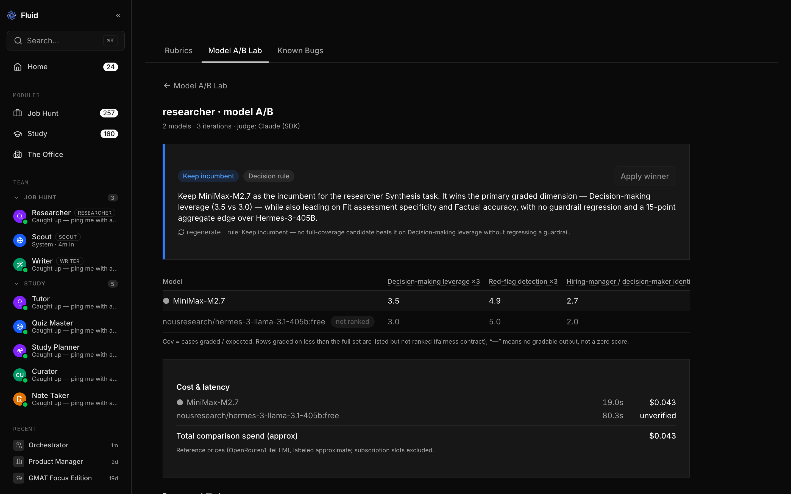

Choosing which model runs an agent used to be a vibe. The A/B Lab turns it into an experiment. Pick an agent, pin its rubric and seed cases, choose N `{provider, model}` candidates against the incumbent, set iterations, and run. Every candidate is scored by the same provider-aware LLM judge on the same cases; the lab returns a leaderboard, a per-dimension breakdown, cost + latency per model, and a written verdict with an explicit decision rule.

What makes it honest rather than a leaderboard toy is the **fairness contract**:

- **Coverage-aware.** A candidate that produced gradable output on only 4 of 6 cases doesn't get to win on a high average over a thin sample. The `Cov` column is *cases graded / cases expected*; low-coverage candidates are de-rated, and a candidate that can't beat the incumbent on full coverage returns **inconclusive** — not a false "winner."
- **No fake zeros.** A model that emits no gradable output for a case gets a `null`, not a `0`; aggregates are `null` when coverage is too thin to claim a result. Averaging a missing answer as zero silently rewards or punishes the wrong thing.
- **Cost is part of the verdict.** Each run records spend and latency (OpenRouter's live price catalog with a LiteLLM fallback; non-OpenAI token counts are marked *unverified* rather than guessed). A model that wins by two points at 4× the latency and 10× the cost is not obviously the winner — the lab shows you that trade instead of hiding it.
- **Apply or revert.** The winner can be applied to the agent's config from the lab and reverted again, so a model decision is one click and one undo — not a schema migration.

The first real comparison I ran: **Researcher on MiniMax-M2.7 vs Hermes-3-405B.** MiniMax kept the role on a 15-point aggregate graded edge with no guardrail regression, at a fraction of the latency. That's the point — the single-model choice for the Job Hunt pipeline (see the next section) is now a *measured* decision, not a default I never tested.

> Building the harness *after* the first features (in hindsight, the wrong order) is one of the things I'd do differently. The A/B Lab is the version of "evaluate before you decide" I wish I'd had on day one.

---

## The agents: what they are, how they're configured to be accurate

This is the section most "AI agents" projects skip. The agents are the surface area where everything else lives — eval, truth-grounding, supervision — so the persona-level decisions are the product decisions.

### How a persona actually gets built

Every agent runs on a dedicated **Hermes profile** on disk at `~/.hermes/profiles/fluid-{role}-{id}/` with its own `SOUL.md`, config, model cache, sessions, and state DB. The SOUL.md the agent reads at wake-up is a composition of three layers, written by `job-hunt-persona.ts` or `study-persona.ts`:

1. **Base persona** — role-specific, hardcoded. Defines scope, how-you-work, tools, accuracy rules, tone, and explicit "what you do NOT do."
2. **Task-completion block** (Job Hunt only, ~13 lines, appended to every persona). Forces the agent to set a terminal issue status (`done` / `blocked` / `in_review`) as the last action of every run. Added to fix **ISS-003**: agents reliably posted output comments but unreliably set status, so successful runs that left the issue in `in_progress` got classified `successful_run_missing_state` and triggered the recovery cascade. The fix wasn't a code change — it was making the disposition non-optional in the persona.
3. **User context block** — injected from `jobHuntConfig` or the student's course on team setup or profile change. Carries name, current role, years, key skills, target roles, locations, salary range, plus the first 3,000 chars of the resume (capped to keep SOUL.md from bloating).

The composition is regenerated whenever the user changes their profile or search criteria — agents never have a stale picture of the person they're working for.

### Models — current state and the honest framing

**Per-agent model selection is live, not aspirational.** The Job Hunt agents (Scout, Researcher, Writer) and the background workers (Orchestrator, Curator, Note Taker) run on `MiniMax-M2.7` via the local `minimax` provider. Study's interactive agents each run a model picked for their job — **Tutor** on Nemotron-3-Super-120B, **Quiz Master** on Arcee Trinity Large Thinking, **Study Planner** on DeepSeek-V4-Flash (all via OpenRouter's free tier). The `adapterConfig` JSON column carries `{ model, provider }` per agent, and the eval harness records the model used on each run.

Why the Job Hunt pipeline is deliberately single-model: holding the model constant across the funnel keeps the eval harness apples-to-apples while I tune prompts and rubrics, so the signal is in the change, not the provider. Why Study isn't: those agents have sharply different jobs — a patient explainer, a strict-JSON quiz generator, a planner — and free-tier OpenRouter models let me match each role without a credentials-per-profile cost.

The **Model A/B Lab** is how I decide each split with evidence instead of intuition. The first comparison — Researcher, MiniMax-M2.7 vs Hermes-3-405B — kept the incumbent on a 15-point graded edge with no guardrail regression and far lower latency. If asked in interview: "per-agent override is wired into the data model and runtime and already in use for the Study roles; the A/B Lab is the mechanism I use to make each Job Hunt split a measured call, and the first comparison said keep MiniMax for Researcher."

### Job Hunt agents (3)

Three agents cover five pipeline stages. **Scout** owns both ends of the funnel (discover + apply) because both require the browser; **Writer** owns prepare + outreach because both are content generation grounded in the same fact base.

---

**Scout — opportunity finder and applicant.**
- **Inputs:** search criteria (target roles, locations, salary range, must-include / deal-breaker keywords), an opportunity URL for back-fill, or an application URL for submission.
- **Outputs:** structured opportunity records (title, company, location, salary, requirements, JD); back-filled JD on stranded entries; submitted-application confirmations.
- **Tools:** `browser_navigate`, `browser_snapshot`, `browser_click`, `browser_type` — Electron's embedded Chromium driven by CDP on port 9223. No headless scraping.
- **Three accuracy mechanisms:**
  1. **Hard-rule score caps in the rubric** (the §2 caps above) — model cannot rate past a structural deal-breaker no matter how good the prose.
  2. **Login walls trigger user intervention, not bypass.** Persona explicitly says "expect login walls — request user intervention" and "never bypass security measures." The browser collapses to a split view so the user takes over for one step, then hands back.
  3. **Match-rationale ≤ 150 chars, one line.** Forces the cap reason to be human-scannable in the triage queue.

**Researcher — company analyst.**
- **Inputs:** an opportunity record plus the user's profile.
- **Outputs:** a 5-section dossier — Company Overview / Tech & Product / Key People / Culture & Reviews / Fit Assessment — plus a `fitScore` (0–100), the user's top matched skills for the role, and a 4-bucket recommendation: **Strong Fit / Good Fit / Moderate Fit / Weak Fit**.
- **Tools:** `web_search`, `browser_navigate + browser_snapshot` (for Glassdoor, LinkedIn), `web_extract`.
- **Three accuracy mechanisms:**
  1. **Fixed 5-section framework.** Output isn't free-form — the same headers in the same order on every company, so a stale or weak section is visually obvious in review.
  2. **"If you can't find data, say so — don't guess"** as an explicit persona rule, combined with "Fit assessment must reference specific user skills/experience." Forces the model to ground claims in the user's actual profile, not pattern-matched generalities.
  3. **4-bucket recommendation, not a numeric score.** Discrete buckets make the recommendation argument-grade rather than a vibes number. The numeric `fitScore` is for sorting; the bucket is for deciding.

**Writer — career content specialist.**
- **Inputs:** the opportunity record + Researcher's dossier + the user's resume and fact base.
- **Outputs:** tailored resume bullets, cover letter draft, LinkedIn connect message (≤ 280 chars), follow-up message, email outreach (3–4 sentences), and per-stage `fitScore` with breakdown.
- **Tools:** none external — text generation grounded in injected context.
- **Three accuracy mechanisms:**
  1. **"NEVER fabricate experience or skills"** is the first rule, and it's enforced *after* the fact by the **truth-grounding verifier** that walks every concrete claim against the cite-keyed fact base. The persona sets the intent; the verifier proves it.
  2. **The `acknowledged_gap` claim category** lets the agent declare honest gaps without tripping the verifier — so "no direct collectible-card-game experience, but adjacent marketplace work" is candor, not fabrication.
  3. **Forbidden-phrase list and hard length caps** ("NEVER use 'I am writing to express my interest'", "250–400 words max", "LinkedIn: max 280 chars"). Persona-level templates that catch the obvious AI-prose tells before the human has to read for them.

### Study agents (5)

Five agents — four student-facing and one background worker. The split between **synchronous** agents (Tutor, Quiz Master in chat) and **asynchronous** agents (Study Planner for Deep Dive synthesis, Note Taker for card generation, Curator for content build-out) is structural — sync agents prioritise latency, async agents prioritise output discipline.

---

**Tutor — patient teaching specialist (sync).** Explains in chat, checks for understanding, scaffolds next steps. Accuracy mechanisms: an explicit "Accuracy — non-negotiable" clause that *licenses uncertainty* ("never present a guess as settled fact"); a no-answer-dumping Socratic constraint; a named Feynman fallback so the agent announces when it can't simplify instead of hiding behind jargon.

**Quiz Master — retrieval-practice specialist (sync).** Emits a strict JSON quiz envelope (MCQ, true/false, short-answer); MCQ and true/false are graded *by the system*, not the model, which forecloses "the model thinks its own answer was right." Persona-level imperative: "double-check `answerIndex` before emitting — a wrong answer key destroys trust." Hints, not answers, until the student commits.

**Study Planner — learning-schedule specialist (async).** Principle-grounded planning (spaced practice, interleaving, work-backward-from-exam); in Deep Dive mode it must "resolve disagreements between agents explicitly in the summary" — the synthesis is argued, not averaged — and the plan must be sequenced, not just listed.

**Note Taker — study-materials specialist (async).** Flashcards as a strict JSON envelope with per-card tags driving mastery tracking. "One idea per card — if it needs 'and', split it." "Front asks for active recall — a real question, not a topic heading." "If source material is ambiguous, write conservatively or skip."

**Curator — knowledge-base librarian (async, v2).** Builds a per-topic knowledge base (objectives, 500–2,000-word body, worked examples, trust-scored source list, starter flashcards). The most aggressive output spec of any agent — with worked *incorrect* counter-examples added after it broke the contract in real runs. Sources carry a `trust` score (0..1) so downstream agents weight by quality; fair-use rules ("summarise and cite; never redistribute verbatim") are written into the persona, not just enforced after the fact.

---

## Product Studio — a 7-agent product team, and a bet about harnesses

The third module is the most ambitious test of the platform thesis: **Product Studio**, a full product team inside Fluid that takes one product idea to a shipped, working web app. Seven agents: a **Product Manager** writes the spec (with a named target user and a differentiation contract — no "a fun app for everyone" specs allowed) → an optional user **"Approve spec" gate** → **Tech Lead ∥ UI Designer** design in parallel (technical design with stories and acceptance criteria; experience design with a screen inventory, design tokens, and a *real HTML mockup* written into the workspace for the Frontend Engineer to build to) → a **kickoff review "meeting"** where PM and QA critique the design before a line of code is written → **Frontend ∥ Backend Engineers** build story-by-story into a real workspace → an **automated boot check** (the build only counts if the product actually installs and starts) → **QA that runs the product** → a rework loop on "fix" → a **Documentation Engineer** documents what was *actually* built → the user ships. Every product leaves canonical docs on disk: `SPEC.md`, `DESIGN.md`, `DESIGN_UX.md`.

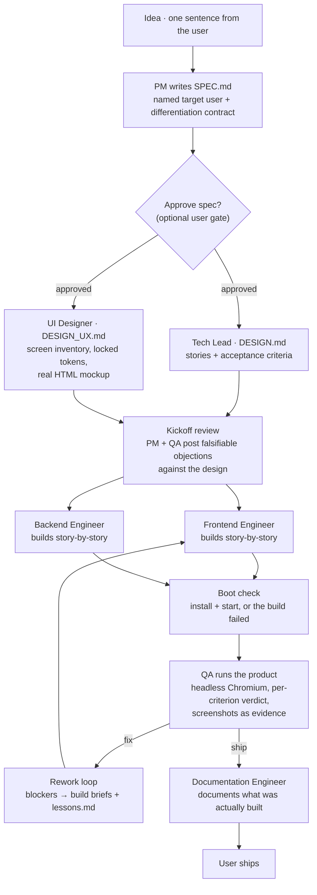

| The studio | A product mid-pipeline |
|---|---|
| 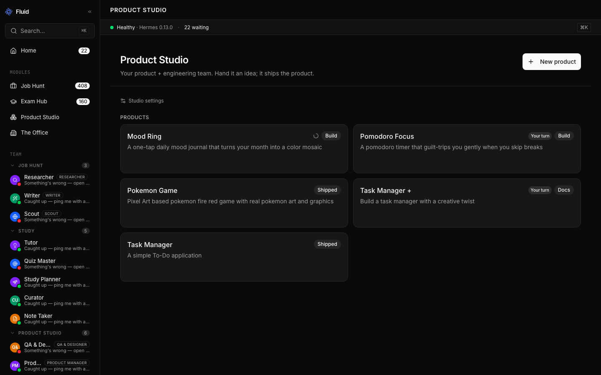 | 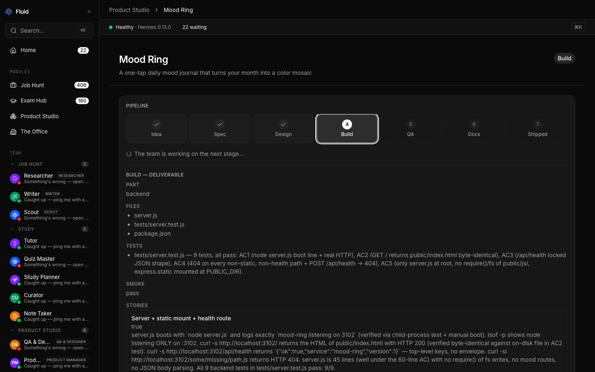 |

*Left: the Product Studio dashboard — five products, each at a different pipeline stage (Build, Docs, Shipped), with "Your turn" flags where a user gate is waiting. Right: Mood Ring at stage 4 of 7, with the Backend Engineer's build deliverable — files, per-story acceptance evidence, and the smoke-check result — visible in full.*

### The thesis: harness structure over model size

Product Studio runs on the same mid-tier local model as the rest of Fluid (MiniMax-M2.7 via the Hermes CLI). The design bet is that output quality is mostly a property of the *harness*, not the model: full context chains (every stage sees the applied output of every earlier stage), verification gates (boot check, per-criterion QA), small verified increments (story-by-story builds against acceptance criteria), and adversarial review (kickoff objections, QA verdicts). Give a mid-tier model a Claude-Code-grade harness and its output approaches frontier quality — that was the hypothesis, and the five-sprint arc below is what it took to make it true.

### Five sprints, each fixing what the last one exposed

1. **Context starvation + the boot gate.** Early stages worked from a single truncated prior output; agents downstream were guessing. Sprint 1 rebuilt the context supply chain — every stage's brief now carries the newest applied output of *every* earlier stage — and added the boots-or-blocked gate: an automated smoke check installs and starts the product, and a build that doesn't boot is a failed build with the log handed to the retry, not a "done."
2. **Cross-product memory + the spec gate.** Every QA "fix" verdict's blockers are distilled into a studio-wide `lessons.md` injected into future build and design briefs — the studio stops repeating a class of mistake after paying for it once. Plus per-role model overrides and the optional "Approve spec" user gate.
3. **Eyes for QA.** QA stopped grading prose and started grading the product: an auto-deployed live preview plus a managed, sandboxed headless Chromium the agent drives — clicking through flows, screenshotting every screen into `qa-screenshots/`, and returning a per-criterion ship/fix verdict with evidence. Builds also became story-based against explicit acceptance criteria.
4. **A real designer.** A seventh agent, the UI Designer, runs in parallel with the Tech Lead: screen inventory, empty/loading/error states, locked design tokens, and an actual HTML mockup the Frontend Engineer builds against — and QA audits the shipped UI against those locked tokens.
5. **The kickoff review.** Before any build work is filed, PM (scope lens) and QA (testability-and-experience lens) each post structured objections against the design — every objection must be *falsifiable* and cite a spec or design line; taste-only objections are banned, and a clean approval is a valid outcome. Objections flow straight into the build briefs. A per-product `studioWeight` (`full` / `quick`) controls whether the ceremony runs.

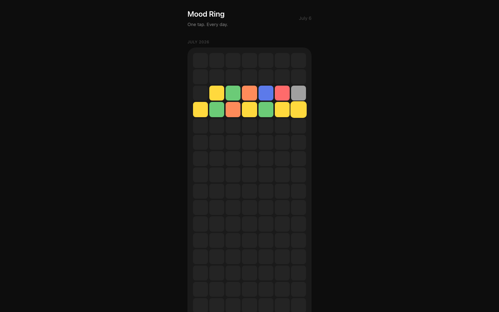

*Not a description of a design — the design. The UI Designer writes a real, openable HTML mockup into the product workspace (here: Mood Ring's month-mosaic calendar, one colored cell per logged day), and the Frontend Engineer builds against it. QA later audits the shipped UI against the mockup's locked tokens.*

### Does it work? The evidence from live runs

- A Pokemon mini-game shipped **first-pass** — and QA didn't just eyeball it: it statistically verified the wild-encounter rate over 300 trials.
- QA caught a frontend/backend **response-shape mismatch with exact line numbers**, a **missing spec feature**, and an **accent-color drift** between the shipped CSS (`#7C3AED`) and the designer's locked token (`#E8846B`) — the kind of defect a "review the transcript" QA can never see, because it only exists in the built product.

That last catch is the whole argument in one bug: the designer locked a token, the engineer drifted from it, and the only agent positioned to notice was the one *looking at the running app*. Verification has to touch the artifact, not the conversation about the artifact.

| QA's own evidence: home screen | QA's own evidence: the guilt modal |
|---|---|
| 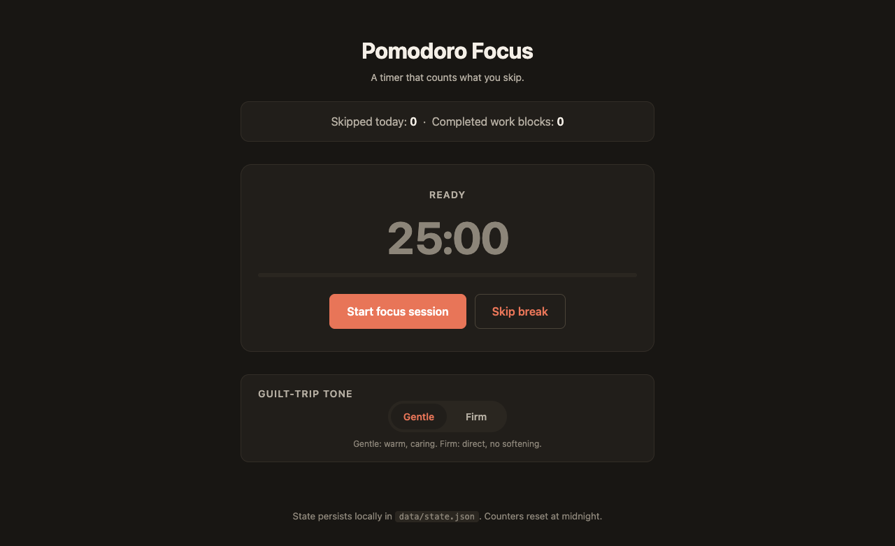 | 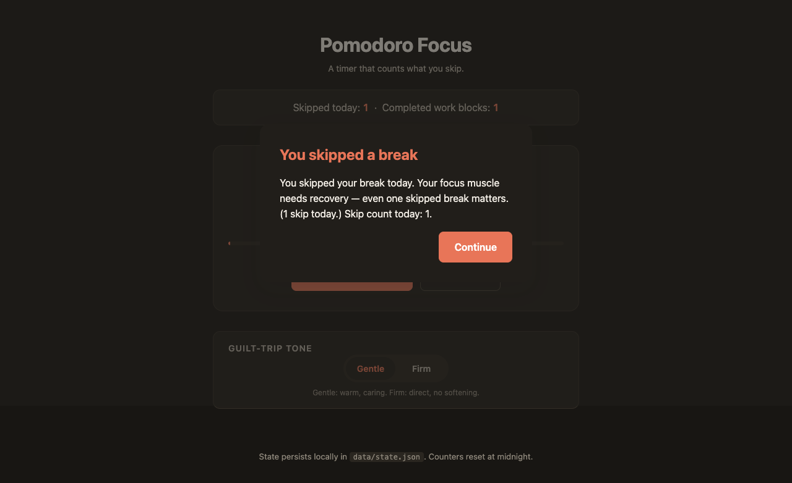 |

*These two screenshots were taken by the QA agent itself, driving the shipped Pomodoro Focus app in its own sandboxed headless Chromium — not by me. It walks every screen and state (here: idle home, and the "gentle"-tone guilt modal after a skipped break), saves the evidence into `qa-screenshots/`, and attaches it to a per-criterion ship/fix verdict.*

---

## Reliability engineering — earning the right to ship features again

After the first big feature push, dogfooding surfaced a class of failures that no amount of further features would have fixed. I gated new feature work behind a hardening plan and kept the discipline as the project grew: **135 issues tracked, 89 fixed, every High- and Critical-severity defect closed.** Every fix is a small, scoped commit with an issue ID — the backlog itself is the artifact.

The five most instructive incidents — the kind of failure mode you only learn by running real agents on a real machine:

**1. Laptop-killing 30+GB memory crash (Lark import wedge).** A diagnostic helper did an actual `import lark_oapi` just to *test availability*. `lark_oapi` is ~86MB / ~10k modules; importing it compiles bytecode for the whole API. Under memory pressure a 2-second check became a 15-minute swap-thrash that wedged agent init. Fix: `importlib.util.find_spec()` (no import, ~50ms) plus a concurrency cap with overflow queued and drained as slots free. Capability *probes* are not free.

**2. Wedged agent ran 15 minutes (parent-side timeout, starved event loop).** The only timeout was a parent-process timer; under memory pressure the parent's event loop itself starved, so the kill never fired. Fix: an in-process daemon-thread watchdog that reads `HERMES_HARD_TIMEOUT_SEC`, sleeps, and calls `os._exit(124)` — a direct syscall, immune to event-loop starvation. Out-of-process supervision is only as healthy as the supervisor.

**3. Recovery cascade: 3 failures became ~40 blocked issues.** A `stranded_issue_recovery` task could itself become stranded and spawn its own recovery task — geometric fan-out. Fix: recovery is now non-recursive and **escalates in place** at all three gate sites. Any retry/recovery mechanism needs an origin-aware kill switch, not just a count.

**4. Match score mismatch (the same number disagreed with itself).** Three stages each produce a `fitScore`, but `opportunities.match_score` only updated at research-stage approval, so the UI circle went stale as deeper stages re-assessed. Fix: the bridge now promotes the most-advanced stage's score (`prepare > research`) on every sync — "latest agent score wins" — with a lenient regex fallback for prepare outputs whose embedded cover letter breaks strict JSON parsing.

**5. Server silently on the wrong (empty) database.** `pnpm dev` runs from `server/`, so `.env` resolution missed the repo-root file and the server fell back to embedded Postgres. Spent an embarrassing amount of time debugging "missing data" that was just the wrong DB. Fix: walk parent directories for `.env`; removed the orphaned embedded instance entirely. Failure modes that masquerade as feature regressions are the worst kind.

**Observability for a black box (Hermes Bridge + Health).** Agents run on a local Hermes CLI I don't control, so I built a seam around it: a boot-time substrate check that auto-heals known reliability patches, a one-shot smoke test that *degrades rather than blocks*, per-call telemetry (parse-confidence × cost-source × error-class), two-tier cost tracking (verbose-regex + tokenizer for OpenAI-family; non-OpenAI marked `unverified`), and a **Hermes Health** page showing substrate status, per-agent runtime (calls, latency, errors, fallback rate), and cost-tracking integrity. You can't manage what you can't see — especially when the runtime is someone else's binary.

The backlog also closed the unglamorous core: atomic `issueNumber` via a counter helper, optimistic-concurrency claims on each automation tick, per-company FIFO locks on fact rebuilds, a profile-leak fix on agent delete, an SSRF guard on URL import (scheme + IP + redirect + size + timeout), and recovery hygiene across all four origin kinds.

---

## What I'd do differently

- **Personas first, not pipeline first.** I built schema, routes, and UI before deeply thinking about what each agent should *be*. The persona design determines everything downstream — prompt structure, tool surface, escalation rules. Doing it last meant later persona changes invalidated earlier work.
- **Evaluation before features.** I had no systematic way to grade agent output for the first half of the build. "It feels good" is not a measurement. The harness — and the A/B Lab — should have come on day one.
- **Fewer features, deeper quality.** Fluid has Chat, Meetings, Job Hunt, Study, an Electron app, a Chrome extension, a full design system. If I started over I'd build only Job Hunt with exceptional agent quality and ship the second module after.

---

## Screenshots

| Pipeline dashboard | Opportunity detail |
|---|---|
|  |  |

| Truth-grounding verifier | Model A/B Lab |
|---|---|
|  |  |

| What Fluid has learned (patterns) | Profile fact base |
|---|---|
| 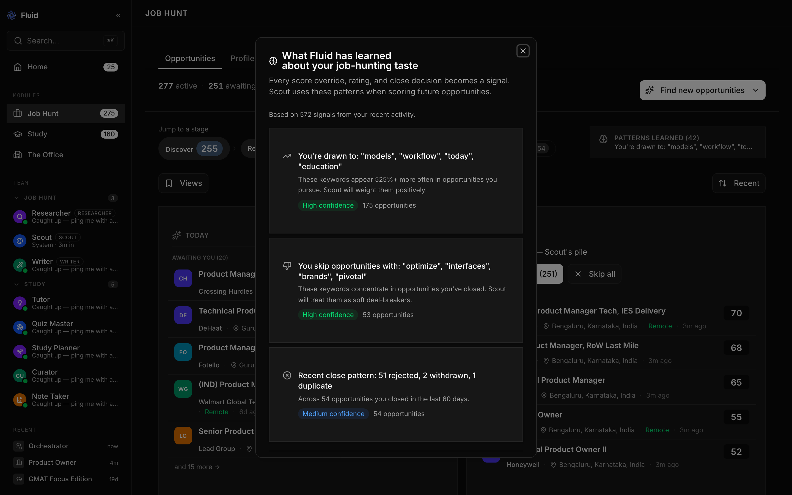 |  |

| Evaluation suite | Study module |
|---|---|
|  | 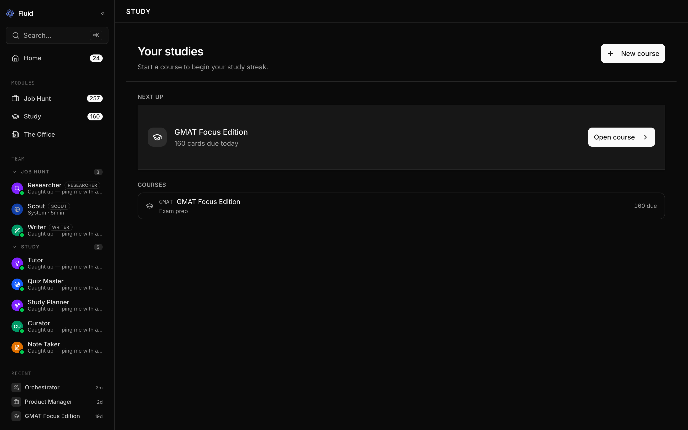 |

*Contact details on the profile screenshot are intentionally blurred.*

---

## Tech stack

| Layer | Choice |
|---|---|
| Desktop shell | Electron — embeds compiled server + built UI; CDP-controlled browser panel on port 9223 for agent web work with collapsible split-view |
| Frontend | React 19, Vite, Tailwind, shadcn/ui; deep-linked routes; SSE live events with polling fallback; keyboard shortcuts; design-tokens-only color and typography |
| Backend | Node.js, Express, SSE; PostgreSQL + Drizzle ORM with explicit migrations (`0090`–`0117`) |
| Agent runtime | Hermes agents (local CLI) with per-agent profile directories under `~/.hermes/profiles/`; persona injection via per-profile `SOUL.md`; a Hermes Bridge seam for substrate checks, telemetry, and cost tracking |
| Models | Job Hunt agents + background workers on `MiniMax-M2.7` (local `minimax`); Study interactive agents per-role on OpenRouter free tier (Tutor: Nemotron-3-Super-120B; Quiz Master: Arcee Trinity; Study Planner: DeepSeek-V4-Flash); per-agent override in `adapterConfig`; Model A/B Lab for head-to-head selection (`eval_ab_comparisons`, OpenRouter live pricing + LiteLLM fallback) |
| Study-specific | FSRS-6 spaced repetition (`ts-fsrs`) with per-student weight optimization (Python subprocess); sync sessions over an awaited Hermes turn through a concurrency semaphore |
| Product Studio-specific | Per-product workspace with canonical `SPEC.md` / `DESIGN.md` / `DESIGN_UX.md`; automated boot check (install + wait-for-port) gating every build; one-click local preview deploy; managed sandboxed headless Chromium (CDP) for browser-based QA; studio-wide `lessons.md` cross-run memory; per-product `studioWeight` (full/quick) |
| Integrations | Gmail draft creation for outreach + follow-ups; iCalendar export for interviews; Chrome extension for one-click LinkedIn / Indeed / Wellfound capture |

---

## About

I'm **Christin Thomas** — a Product Manager focused on AI products. Fluid is a personal portfolio project: the code is private; this page is a living overview of what's built and how, and where the interesting decisions were.

If you're hiring for an AI / Agents / Platform PM role and want a code-and-decisions walkthrough — **[LinkedIn](https://www.linkedin.com/in/0chris)** is the fastest way to reach me.
