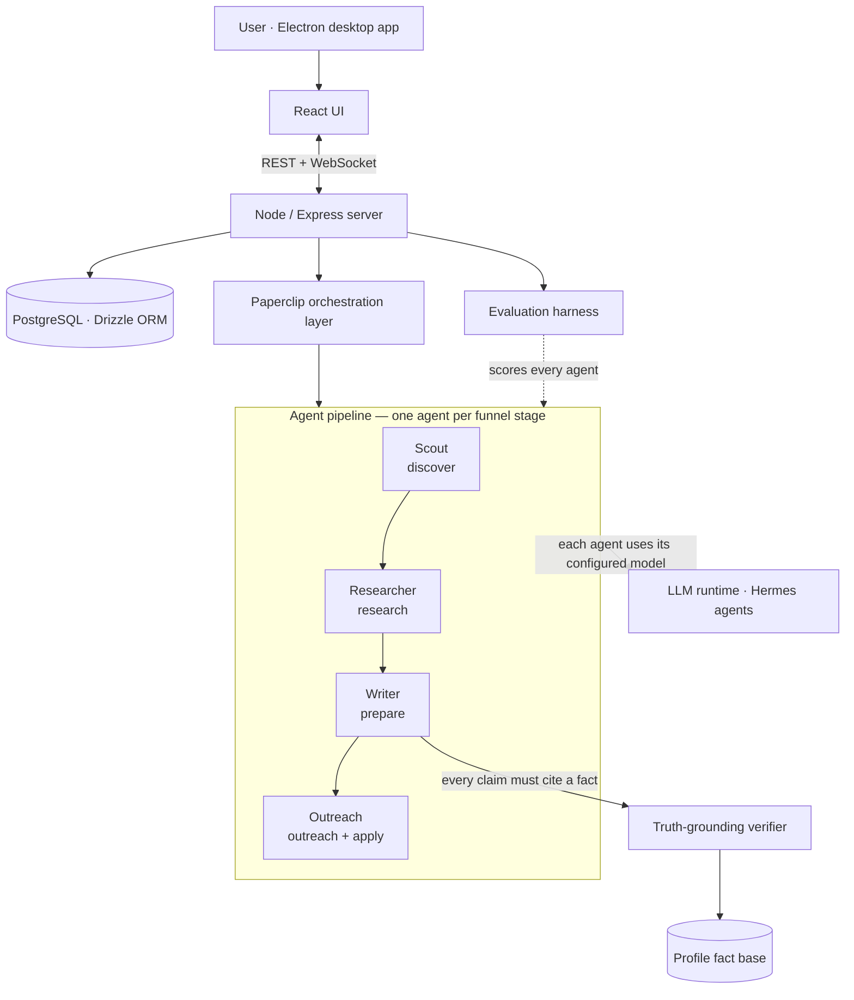

# Fluid

**An AI desktop app that runs a job search as a team of autonomous agents — with the evaluation and guardrail systems to keep them honest.**

> A personal project by Christin Thomas, built to go deep on the hard part of agentic AI products: making agents *trustworthy and measurable*, not just functional.

---

## What it is

Fluid turns a job search into a supervised multi-agent pipeline. Instead of one chatbot, it runs four specialised agents — each owning one stage of the funnel — coordinated by an orchestration layer, grounded in a verified fact base, and continuously measured by an evaluation harness.

It is a **Hermes + Paperclip** stack wrapped in an **Electron** desktop app. The agents do real work — browse job boards, research companies, draft tailored application materials — but the project's centre of gravity is the systems *around* the agents: evaluation, truth-grounding, and reliability engineering.

## Why I built it

Most "AI agent" demos work in the happy path and fall apart everywhere else. As a PM, I wanted to build the unglamorous parts for real:

- **How do you know an agent is good?** → an evaluation harness, not vibes.
- **How do you stop an agent from making things up?** → a mechanical truth-grounding guardrail.
- **What happens when agents fail at scale?** → concurrency limits, timeout backstops, recovery logic.

Fluid is where I answered those questions with working code.

## How it works

Each opportunity moves through a five-stage funnel — **discover → research → prepare → outreach → apply** — and every stage's output is a versioned artifact the user reviews and approves.

## The hard parts

These are the systems that make Fluid a product rather than a demo.

### Evaluation harness
Agents are non-deterministic, so I test them like a product, not a script. The harness runs each agent against fixed test cases with:
- **Two modes** — *prompt mode* (fast, isolates the agent's reasoning) and *pipeline mode* (full integration through the live runtime).
- **Graded vs. guardrail dimensions** — graded dimensions score quality; guardrail dimensions are pass/fail safety checks.
- **N-iteration averaging** — repeats runs to measure consistency, not a lucky single sample.
- **Per-agent rubrics** — each agent is judged against criteria specific to its job.

### Truth-grounding guardrail
Every concrete claim an agent writes — a metric, a scope, an achievement — must trace to a **cite-keyed fact** in a structured fact base extracted from the user's real career history. A mechanical verifier then walks the agent's output and flags any claim that doesn't trace back. It catches fabrication *before* it reaches an application. The guardrail is deterministic by design: fast, explainable, and impossible to fool with confident-sounding prose.

### Reliability engineering
Running autonomous agents on a real machine surfaced real failure modes, and I fixed them at the root:
- **Concurrency limits** — a cap on simultaneous agents, with excess work queued and drained, after an unbounded burst exhausted host memory.
- **Timeout backstops** — an in-process watchdog that hard-terminates a wedged agent, immune to event-loop starvation.
- **Recovery-cascade prevention** — recovery tasks can no longer spawn their own recovery tasks, stopping a geometric fan-out of failures.

## Demo

<!-- Replace with your recorded walkthrough -->
<!-- [▶ Watch the 2-minute demo](https://your-demo-video-link) -->

*Demo video — coming soon.*

## Screenshots

| Pipeline dashboard | Opportunity detail | Evaluation report |
|---|---|---|
|  |  |  |

| Truth-grounding verifier | Profile fact base |
|---|---|
|  |  |

## Tech stack

| Layer | Technology |
|---|---|
| Desktop shell | Electron |
| Frontend | React 19, Vite, Tailwind CSS, shadcn/ui |
| Backend | Node.js, Express |
| Data | PostgreSQL, Drizzle ORM |
| Agent runtime | Hermes agents + Paperclip orchestration |
| Models | Anthropic-compatible LLM APIs |

## About

Built by **Christin Thomas** — Product Manager focused on AI and growth.

This is a personal portfolio project. The source code is private; this page is a living overview of what the product is and how it's built.

<!-- Add your links -->
[LinkedIn](https://www.linkedin.com/in/0chris) · *Reach out for a code walkthrough.*
