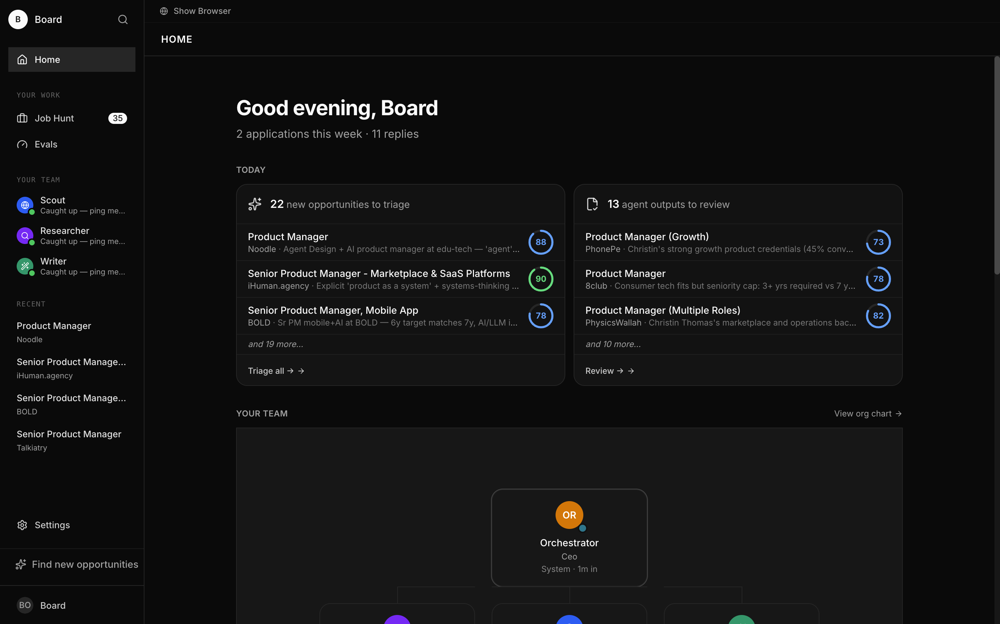
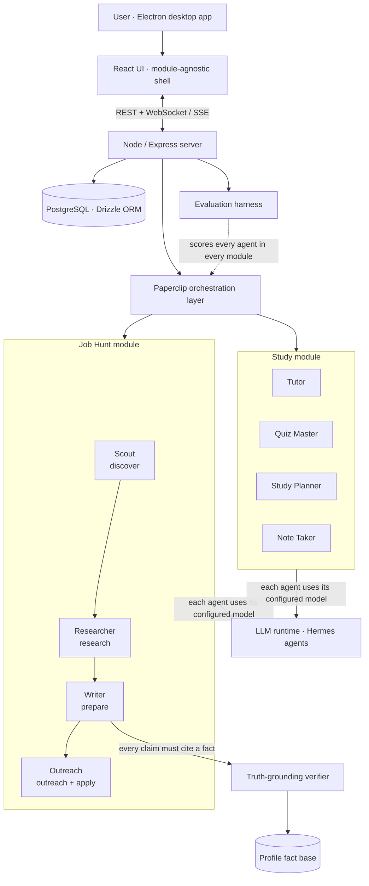
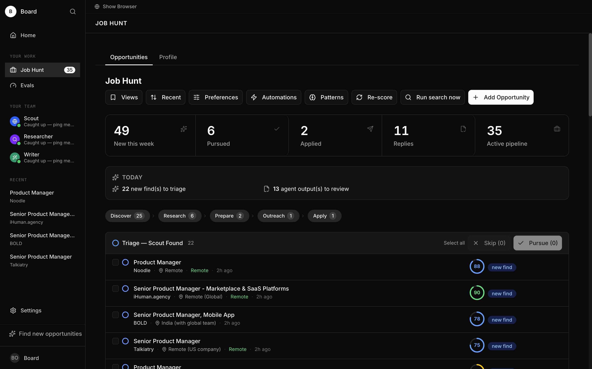
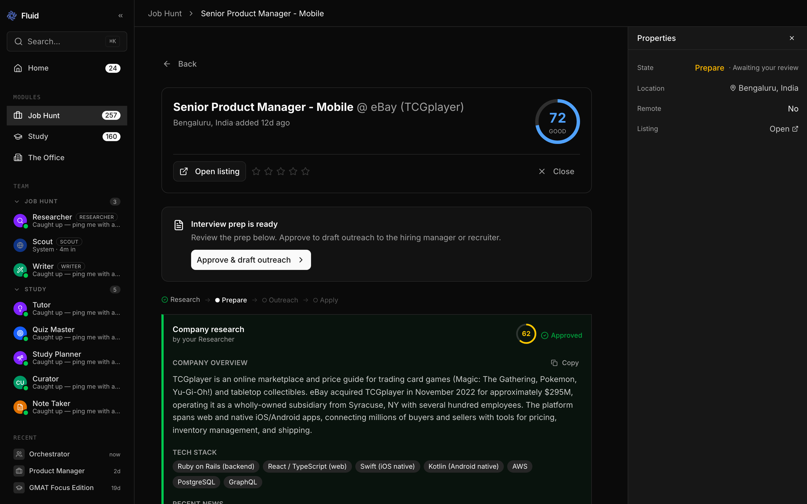
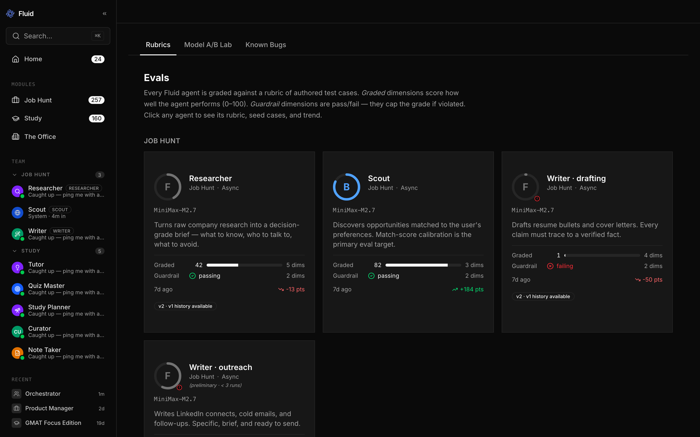
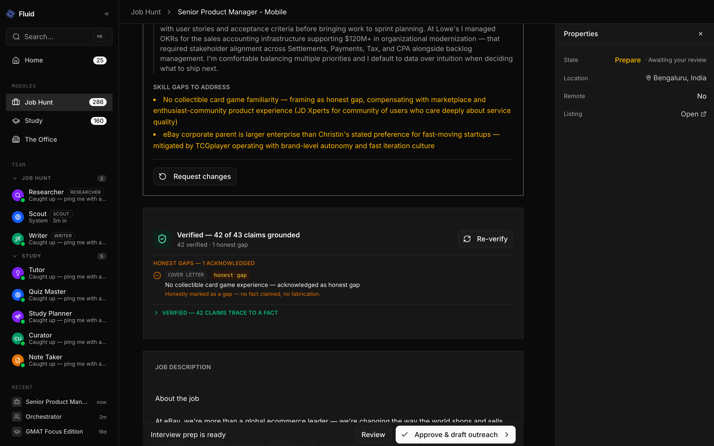
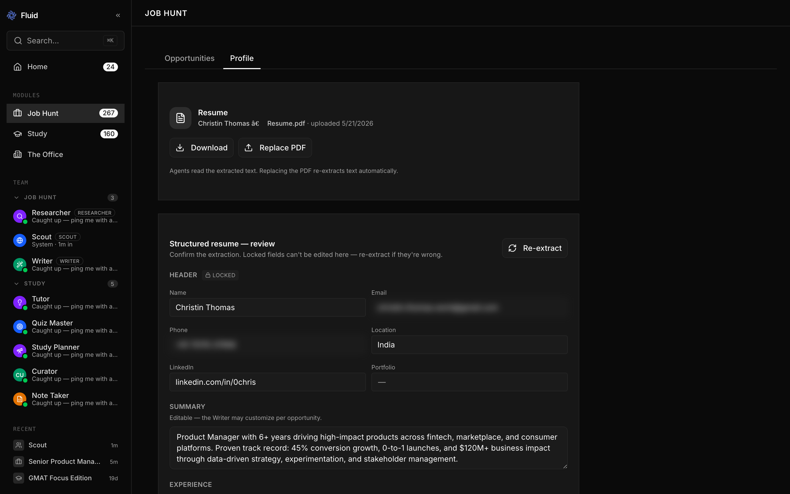

# Fluid

**An AI desktop app that runs supervised teams of autonomous agents — with the evaluation and guardrail systems to keep them honest.**

> A personal project by Christin Thomas, built to go deep on the hard part of agentic AI products: making agents *trustworthy and measurable*, not just functional.

---

## What it is

Fluid is a desktop **agent platform**. The shell is domain-agnostic; the work gets done by **modules**, each of which plugs a small team of specialised agents into a real workflow.

Two modules are live:

- **Job Hunt** — four agents (Scout → Researcher → Writer → Outreach) run a job search as a supervised pipeline: discover roles, research companies, draft tailored materials, manage outreach and applications.
- **Study** — four agents (Tutor, Quiz Master, Study Planner, Note Taker) run a university student's coursework: a course/topic tree, FSRS-6 spaced repetition, synchronous study sessions and Quiz Me, async content import, and a Deep Dive that reuses the platform's meeting synthesizer.

Both modules share the same foundations: a **Hermes + Paperclip** agent runtime, a profile-grounded **truth verifier**, and an **evaluation harness** that scores every agent. The platform is wrapped in an **Electron** desktop app. The agents do real work, but the project's centre of gravity is the systems *around* the agents — evaluation, truth-grounding, and reliability engineering.

## Why I built it

Most "AI agent" demos work in the happy path and fall apart everywhere else. As a PM, I wanted to build the unglamorous parts for real:

- **How do you know an agent is good?** → an evaluation harness, not vibes.
- **How do you stop an agent from making things up?** → a mechanical truth-grounding guardrail.
- **What happens when agents fail at scale?** → concurrency limits, timeout backstops, recovery logic, atomic counters, optimistic concurrency.
- **How do you reuse all of that for a second use case?** → a module abstraction, so a new domain is a new team and a new workflow, not a new product.

Fluid is where I answered those questions with working code, then proved the second one by shipping a second module on the same foundations.

## How it works

Each Job Hunt opportunity moves through a five-stage funnel — **discover → research → prepare → outreach → apply** — and every stage's output is a versioned artifact the user reviews and approves. The Study module runs a different loop — courses, topics, due-card review, sessions, quizzes — but plugs into the same agent runtime, eval harness, and UI shell.

## The hard parts

These are the systems that make Fluid a product rather than a demo.

### Evaluation harness
Agents are non-deterministic, so I test them like a product, not a script. The harness runs each agent against fixed test cases with:
- **Two modes** — *prompt mode* (fast, isolates the agent's reasoning) and *pipeline mode* (full integration through the live runtime).
- **Graded vs. guardrail dimensions** — graded dimensions score quality; guardrail dimensions are pass/fail safety checks.
- **N-iteration averaging** — repeats runs to measure consistency, not a lucky single sample.
- **Per-agent rubrics** — each agent is judged against criteria specific to its job. Both Job Hunt (Scout / Researcher / Writer / Outreach) and Study (Tutor / Quiz Master) agents are registered eval stages.

### Truth-grounding guardrail
Every concrete claim a Job Hunt agent writes — a metric, a scope, an achievement — must trace to a **cite-keyed fact** in a structured fact base extracted from the user's real career history (resume + uploaded long-form documents). A mechanical verifier walks the agent's output and flags any claim that doesn't trace back. It catches fabrication *before* it reaches an application. The guardrail is deterministic by design: fast, explainable, and impossible to fool with confident-sounding prose.

### Reliability engineering
Running autonomous agents on a real machine surfaces real failure modes. After the first big feature push, I ran a **three-sprint hardening pass** before any further feature work: 80 issues triaged, 39 fixed, **all 15 High-severity defects closed**. A sample of what was fixed:

- **Concurrency limits + timeout backstops** — a cap on simultaneous agents (excess work queued and drained, after an unbounded burst exhausted host memory), plus an in-process watchdog that hard-terminates a wedged agent immune to event-loop starvation.
- **Recovery-cascade prevention** — recovery tasks can no longer spawn their own recovery tasks, stopping a geometric fan-out of failures.
- **Atomic counters and optimistic concurrency** — issue numbering and automation ticks no longer race; each claim is an atomic, contended-safe write.
- **Per-company FIFO locks** — fact-base rebuilds serialise per-company so concurrent updates can't interleave.
- **SSRF guard on user-supplied URLs** — Study's content import validates scheme, IP range, redirect chain, response size, and timeout before fetching.
- **Recovery hygiene** — every origin kind is now handled; agents at the concurrency cap are terminated rather than queued forever; dead bridge code removed.

### Module abstraction
The Study module proved the platform thesis: a new domain is a new team and a new workflow, not a new app. The UI shell, agent runtime, eval harness, truth verifier, profile/fact infrastructure, meeting synthesizer, and reliability primitives are all shared. The module-specific pieces — schema, prompts, personas, pages, automations — sit behind a thin contract.

## Demo

<!-- Replace with your recorded walkthrough -->
<!-- [▶ Watch the 2-minute demo](https://your-demo-video-link) -->

*Demo video — coming soon.*

## Screenshots

| Pipeline dashboard | Opportunity detail | Evaluation report |
|---|---|---|
|  |  |  |

| Truth-grounding verifier | Profile fact base |
|---|---|
|  |  |

*Study module screenshots coming with the next portfolio update.*

## Tech stack

| Layer | Technology |
|---|---|
| Desktop shell | Electron (with CDP-controlled browser panel for agent web work) |
| Frontend | React 19, Vite, Tailwind CSS, shadcn/ui |
| Backend | Node.js, Express, SSE for live updates |
| Data | PostgreSQL, Drizzle ORM |
| Agent runtime | Hermes agents + Paperclip orchestration |
| Models | Anthropic-compatible LLM APIs (per-agent model selection) |
| Spaced repetition | FSRS-6 with per-student weight optimisation |

## About

Built by **Christin Thomas** — Product Manager focused on AI and growth.

This is a personal portfolio project. The source code is private; this page is a living overview of what the product is and how it's built.

<!-- Add your links -->
[LinkedIn](https://www.linkedin.com/in/0chris) · *Reach out for a code walkthrough.*
