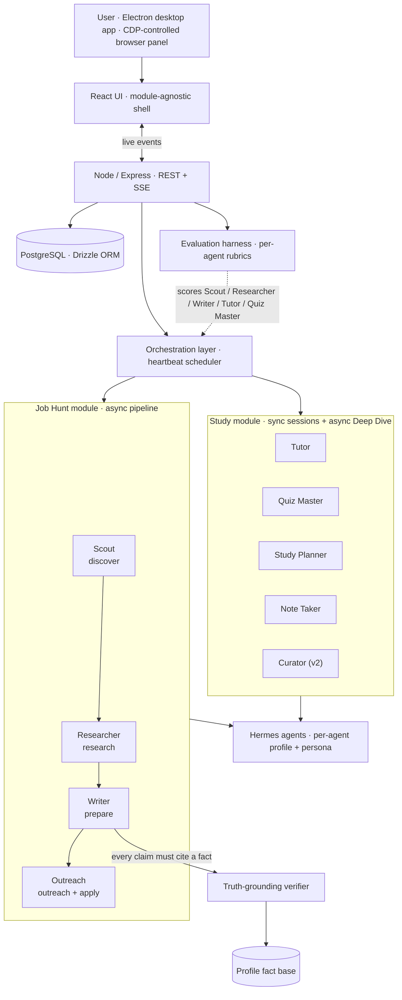

# Fluid

**A desktop AI agent platform I built solo while on parental leave — to answer the questions every "AI agents" demo dodges: how do you know they're any good, how do you stop them lying, and what happens when they fail at 2 AM.**

A Product Manager's portfolio project by [Christin Thomas](https://www.linkedin.com/in/0chris) (PM, Lowe's; previously Fluid Cloud / Razorpay). Built to ship the unglamorous parts of agentic AI for real, then prove the platform thesis by shipping a second module on the same foundations.

---

## TL;DR

- **Two live modules on one runtime.** **Job Hunt** (4 agents, 5-stage pipeline) and **Study** (4 agents + a 5th Curator, FSRS-6 spaced repetition, sync sessions and async Deep Dive). Same orchestration layer, same eval harness, same guardrails — different domain.
- **Built for trust, not demos.** A deterministic truth-grounding verifier blocks fabricated claims before they leave the app. An evaluation harness scores every agent against per-role rubrics, with separate **graded** and **guardrail** (pass/fail) dimensions, and N-iteration averaging so a lucky single run can't mask flaky behaviour.
- **Hardened the way real products are.** After the first feature push I paused and ran a **three-sprint stabilization gate** before shipping anything new: 80 issues triaged, **39 fixed, all 15 High-severity defects closed** — atomic counters, optimistic concurrency, FIFO locks, SSRF guards, recovery hygiene, an OS-level timeout backstop that survives a starved event loop.

Most of what this README is about is *what changed because of what broke*. The agents are table stakes.

---

## Why I built it, and how I scoped it

I'd just become a dad and was six weeks into a PM job search for AI / Growth / Platform roles. The arithmetic on each opportunity — ~30 min company research, ~30 min resume tailoring, ~20 min contact finding, ~15 min applying — multiplied by 50–100 targets, hits weeks of full-time work I didn't have. I wasn't going to send generic resumes; I also wasn't going to spend two hours per app.

The bet: agents can do the repetitive parts (search, research, drafting, contact discovery) if I'm willing to build the supervision layer around them. That layer — not the agents themselves — is the actual product. So I built Fluid as a PM exercise in agent governance: how to scope roles, where to put approval gates, how to ground claims, how to measure quality, how to fail safely. The job-search domain was the forcing function; the goal was a framework I could prove transferable.

That transfer happened the week of 2026-05-22 when I shipped the **Study module** — university coursework, four new agents, FSRS-6 spaced repetition, async Deep Dive — on the same shell, same runtime, same eval harness. It validated the platform thesis I'd been claiming on paper.

---

## What it is

Two distinct execution paths sit underneath the same UI shell, which was a real design choice rather than an accident:

- **Async / heartbeat path** — Job Hunt, Meetings, Study content import and Deep Dive, Study Curator. Work becomes a tracked issue; a heartbeat scheduler wakes the right agent; a bridge service lenient-parses the agent's output back into domain tables. This is where the truth verifier runs.
- **Sync path** — Study Tutor sessions and Quiz Me. An awaited Hermes turn through a concurrency semaphore: no issue, no scheduler, no bridge. The student is sitting in front of the conversation; latency is the product.

Keeping these explicitly separate — rather than forcing one path to serve both — was the architectural decision that made Study tractable on the Job Hunt shell.

---

## The six decisions that actually defined the product

### 1. Approval gates instead of full autonomy

The agents are perfectly capable of running an opportunity end-to-end without me. I deliberately broke the pipeline into reviewable artifacts at every stage. The asymmetry is the point: a generic cover letter sent to a company I'd never work for costs me a real foot in a real door; a 30-second review costs almost nothing. Every stage emits a versioned artifact — research dossier, tailored resume bullets, outreach draft, application checklist — and I approve before the next stage starts.

This is what most "autonomous agent" demos get wrong. Autonomy is not the goal. Reviewable, interruptible, reversible work *is*.

### 2. Match-scoring with explicit hard-rule caps

Early Scout outputs were too forgiving — a 78/100 on a role that required 10+ years when I have 6. I rewrote the rubric so the model can't be polite past structural mismatch:

- Deal-breaker keyword present → score caps at **30**
- Below minimum salary floor → caps at **50**
- Missing all "must-include" themes (AI / Growth / Platform) → caps at **40**
- Seniority mismatch → caps at **60**

And the cap must be articulated in the rationale, in one line, ≤ 150 chars. The triage workflow went from "open every JD" to "scan score + one-line cap, decide the borderlines in 90 seconds." This is the unsexy work of making a model's output decision-grade.

### 3. Roles and boundaries instead of one super-agent

The first version had a single "CEO" agent that handled everything. Given a task to enrich job descriptions from LinkedIn URLs, it tried to do it itself instead of delegating to the browser-capable agent. Adding *organizational* structure — not a bigger model — fixed it: each agent has an explicit scope, an explicit toolset, an explicit list of what it should NOT do, and (for the orchestrator) a delegation rule book. Clear lanes in agents are the same problem as clear lanes in a real team.

A direct consequence: when I added the Study module, "what four roles, with what boundaries" was the design question I already knew how to answer.

### 4. Truth-grounding as a deterministic guardrail

Every concrete claim a Job Hunt writer agent emits — a metric, a scope, an achievement — must trace to a **cite-keyed fact** in a profile fact base extracted from my real resume plus an uploaded long-form career doc. A mechanical verifier walks the output, matches each claim against the fact base, and flags anything that doesn't trace. Deterministic by design: fast, explainable, impossible to fool with confident prose.

Two things I learned the hard way and fixed:
- The bridge originally deduped outputs by `(opportunity, stage, agent)`, which meant a re-run of the same stage silently kept the *older* output. The dedup is now **time-aware**: an output only counts as "this issue's" if its `createdAt >= issue.startedAt`. Spent half a day on a verifier showing 0 of N matches before I found this.
- Honest gaps were being flagged as fabrications. Added a third claim category — **`acknowledged_gap`** — so "I don't have direct fintech experience, but…" is recognized as candor, not a lie. Surface area for the model to be honest matters as much as surface area to catch dishonesty.

### 5. Cross-opportunity learning loop

Most AI products are static — each interaction is independent. Fluid captures every score override, rationale rewrite, star rating, and close reason as a timeline event. A pattern aggregator computes lift-based keyword discriminators ("5-star opps share AI/ML, B2B SaaS, Senior PM"; "consulting roles close-rejected ~90% of the time"; "RTO-required roles I downgrade to <40") and produces a structured user fingerprint that gets injected into Scout's match-scoring prompt and every downstream agent's task prompt.

The "Patterns Fluid has learned" view is the strongest demo moment in the product, because it's the moment the agents stop feeling generic — they're reading my own decisions back at me.

### 6. Module abstraction proven by Study

The Study module shipped in a focused week (commits between 2026-05-22 and 2026-05-23) and was the test of whether the platform thesis was real or marketing. Shared with Job Hunt: UI shell, sidebar, Home, agent runtime, profile/fact infrastructure, eval harness, meeting synthesizer, reliability primitives, on-disk Hermes profile management. Module-specific: schema, prompts, personas, pages, FSRS engine, automations.

The Job Hunt-only Home was rewritten into a module-agnostic shell (`useStudyHome` + `useJobHuntHome`, shared activity feed) so neither module is privileged. Study v2 then went further — added a fifth "Curator" agent that ingests user material and open-web sources into a per-topic knowledge base, plus a guided on-ramp UI for students starting from zero. The same shell absorbed it cleanly.

---

## Reliability engineering — the three sprints that earned the right to ship features again

After the first big feature push, dogfooding surfaced a class of failures that no amount of further features would have fixed. I gated all new feature work behind a **three-sprint hardening plan**. Numbers at the end:

- **80 issues triaged, 39 fixed, all 15 Highs closed.**
- Cloud Readiness prerequisite met. Sprint 4 (next feature work) unblocked.

The five most instructive incidents — these are the kind of failure modes you only learn by running real agents on a real machine:

**1. Laptop-killing 30+GB memory crash (Lark import wedge).** A diagnostic helper called `_check_feishu` did an actual `import lark_oapi` just to *test availability*. `lark_oapi` is ~86MB, ~10k modules; importing it compiles bytecode for the whole Lark API. Under memory pressure a 2-second check became a 15-minute hang while the machine swapped, wedging agent init. Compounded by a concurrent dispatcher firing all agents with no cap. Fix: `importlib.util.find_spec()` (no import, ~50ms) plus `JOB_HUNT_MAX_CONCURRENT_AGENTS = 2` with overflow work queued and drained as slots free. The lesson: capability *probes* are not free.

**2. Wedged agent ran 15 minutes (parent-side timeout, starved event loop).** The only timeout was a parent-process timer; under memory pressure the parent's event loop itself starved, so the kill never fired. Fix: an opt-in in-process daemon-thread watchdog in `cli.py` that reads `HERMES_HARD_TIMEOUT_SEC`, sleeps, and calls `os._exit(124)` — a direct syscall, immune to event-loop starvation. Defaulted to 40 minutes. Out-of-process supervision is only as healthy as the supervisor.

**3. Recovery cascade: 3 failures became ~40 blocked issues.** A `stranded_issue_recovery` task could itself become stranded and spawn its own recovery task — geometric fan-out. Fix: recovery is now non-recursive. Any recovery-origin issue **escalates in place** instead of spawning a child, at all three gate sites. Audited and bulk-cancelled the 40 stale issues. The general principle: any retry/recovery mechanism needs an origin-aware kill switch, not just a count.

**4. Match score mismatch (the same number disagreed with itself).** Three stages each produce a `fitScore`, but `opportunities.match_score` was only updated at *research-stage approval*. So the circle in the UI went stale as deeper stages re-assessed. Fix: the bridge now promotes the most-advanced stage's fitScore (`prepare > research`) to `match_score` on every sync — "latest agent score wins." With a lenient regex fallback for prepare outputs whose embedded cover letter breaks strict JSON parsing.

**5. Server silently on the wrong (empty) database.** `pnpm dev` runs from `server/`, so `resolve(process.cwd(), ".env")` looked in `server/` and missed the repo-root `.env` — and the server fell back to embedded Postgres. Spent an embarrassing amount of time debugging "missing data" that was just the wrong DB. Fix: `findEnvFileUpwards()` walks parent directories. Removed the orphaned embedded instance entirely. Failure modes that masquerade as feature regressions are the worst kind.

The Sprint 1–3 backlog also closed: atomic `issueNumber` via a counter helper (ISS-032/054), optimistic-concurrency claim on each automation tick (ISS-031), per-company FIFO lock on `rebuildProfileFacts` (ISS-036), profile-leak fix on `agentService.remove` (Study integration A3), SSRF guard on Study's URL import (scheme + IP + redirect + size + timeout, ISS-015), and recovery hygiene that handles all four origin kinds and terminates terminated-cap agents (ISS-050/051/052/034). Every fix was a small, scoped commit with an issue ID — the backlog itself is the artifact.

---

## Evaluation harness

Agents are non-deterministic, so the only way to manage them is to test them like a product, not a script.

- **Two modes** — *prompt mode* runs each agent against a fixed prompt to isolate reasoning quality (fast, cheap, deterministic enough to grade); *pipeline mode* runs through the live runtime to catch integration regressions.
- **Graded vs. guardrail dimensions** — graded dimensions score quality on a rubric; guardrail dimensions are pass/fail safety checks. A guardrail failure fails the run regardless of how good the graded score was.
- **N-iteration averaging** — every test case repeats N times to measure consistency, not a lucky sample. A flaky agent that wins one in three is still a bad agent.
- **Per-agent rubrics** — each agent is judged against criteria specific to its role. Scout / Researcher / Writer / Outreach, plus Tutor and Quiz Master, are all registered eval stages on the same harness.
- **Suite reports with rollups** — pass/fail breakdown, score distributions, per-dimension drilldown. This is the artifact I'd hand to someone reviewing a model swap.

Building the harness *after* the first features (in hindsight, the wrong order) is one of the things I'd do differently.

---

## What I'd do differently

- **Personas first, not pipeline first.** I built the schema, routes, and UI before deeply thinking about what each agent should actually *be*. The persona design determines everything downstream — prompt structure, tool surface, escalation rules. Doing it last meant later persona changes invalidated earlier work.
- **Evaluation before features.** I had no systematic way to grade agent output for the first half of the build. "It feels good" is not a measurement. The harness should have come on day one.
- **Fewer features, deeper quality.** Fluid has Chat, Meetings, Job Hunt, Study, an Electron app, a Chrome extension, a full design system. If I started over I'd build only Job Hunt with exceptional agent quality and ship the second module after.

---

## Screenshots

| Pipeline dashboard | Opportunity detail | Evaluation report |
|---|---|---|
|  |  |  |

| Truth-grounding verifier | Profile fact base |
|---|---|
|  |  |

*Study module screenshots and a walkthrough video are in the next update.*

---

## Tech stack

| Layer | Choice |
|---|---|
| Desktop shell | Electron — embeds compiled server + built UI; CDP-controlled browser panel on port 9223 for agent web work with collapsible split-view |
| Frontend | React 19, Vite, Tailwind, shadcn/ui; deep-linked routes; SSE live events with polling fallback; keyboard shortcuts; design-tokens-only color and typography |
| Backend | Node.js, Express, SSE; PostgreSQL + Drizzle ORM with explicit migrations (`0090`–`0104`) |
| Agent runtime | Hermes agents (local CLI) with per-agent profile directories under `~/.hermes/profiles/`; persona injection via per-profile `SOUL.md` |
| Models | Per-agent model selection; default `MiniMax-M2.7` via the Hermes-MiniMax adapter; Anthropic-compatible providers supported |
| Study-specific | FSRS-6 spaced repetition (`ts-fsrs`) with per-student weight optimization (Python subprocess); sync sessions over an awaited Hermes turn through a concurrency semaphore |
| Integrations | Gmail draft creation for outreach + follow-ups; iCalendar export for interviews; Chrome extension for one-click LinkedIn / Indeed / Wellfound capture |

---

## About

I'm **Christin Thomas** — Product Manager focused on AI products. Previously built and shipped at Lowe's, before that at Fluid Cloud / Razorpay. Fluid is a personal portfolio project: the code is private; this page is a living overview of what's built and how, and where the interesting decisions were.

If you're hiring for an AI / Agents / Platform PM role and want a code-and-decisions walkthrough — **[LinkedIn](https://www.linkedin.com/in/0chris)** is the fastest way to reach me.
