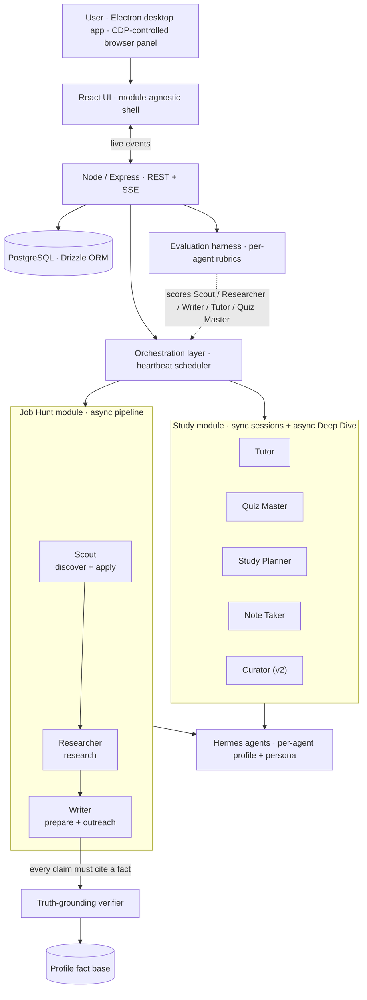

# Fluid

**A desktop AI agent platform built to answer the questions every "AI agents" demo dodges: how do you know they're any good, how do you stop them lying, and what happens when they fail at 2 AM.**

A Product Manager's portfolio project by [Christin Thomas](https://www.linkedin.com/in/0chris). Built to ship the unglamorous parts of agentic AI for real — evaluation, truth-grounding, reliability — and to prove the platform thesis by reusing the same shell for a second domain.

---

## TL;DR

- **Two live modules on one runtime.** **Job Hunt** (3 agents covering a 5-stage pipeline) and **Study** (5 agents — 4 student-facing plus a background Curator — FSRS-6 spaced repetition, sync sessions and async Deep Dive). Same orchestration layer, same eval harness, same guardrails — different domain.
- **Built for trust, not demos.** A deterministic truth-grounding verifier blocks fabricated claims before they leave the app. An evaluation harness scores every agent against per-role rubrics, with separate **graded** and **guardrail** (pass/fail) dimensions, and N-iteration averaging so a lucky single run can't mask flaky behaviour.
- **Hardened the way real products are.** After the first feature push I paused and ran a **three-sprint stabilization gate** before shipping anything new: 80 issues triaged, **39 fixed, all 15 High-severity defects closed** — atomic counters, optimistic concurrency, FIFO locks, SSRF guards, recovery hygiene, an OS-level timeout backstop that survives a starved event loop.

Most of what this README is about is *what changed because of what broke*. The agents are table stakes.

---

## What it is

Two distinct execution paths sit underneath the same UI shell, which was a real design choice rather than an accident:

- **Async / heartbeat path** — Job Hunt, Meetings, Study content import and Deep Dive, Study Curator. Work becomes a tracked issue; a heartbeat scheduler wakes the right agent; a bridge service lenient-parses the agent's output back into domain tables. This is where the truth verifier runs.
- **Sync path** — Study Tutor sessions and Quiz Me. An awaited Hermes turn through a concurrency semaphore: no issue, no scheduler, no bridge. The student is sitting in front of the conversation; latency is the product.

Keeping these explicitly separate — rather than forcing one path to serve both — was the architectural decision that made Study tractable on the Job Hunt shell.

---

## The six decisions that actually defined the product

### 1. Approval gates instead of full autonomy

The agents are perfectly capable of running an opportunity end-to-end without me. I deliberately broke the pipeline into reviewable artifacts at every stage. The asymmetry is the point: a generic cover letter sent to a company I'd never work for costs me a real foot in a real door; a 30-second review costs almost nothing. Every stage emits a versioned artifact — research dossier, tailored resume bullets, outreach draft, application checklist — and I approve before the next stage starts.

This is what most "autonomous agent" demos get wrong. Autonomy is not the goal. Reviewable, interruptible, reversible work *is*.

### 2. Match-scoring with explicit hard-rule caps

Early Scout outputs were too forgiving — a 78/100 on a role that required 10+ years when I have 6. I rewrote the rubric so the model can't be polite past structural mismatch:

- Deal-breaker keyword present → score caps at **30**
- Below minimum salary floor → caps at **50**
- Missing all "must-include" themes (AI / Growth / Platform) → caps at **40**
- Seniority mismatch → caps at **60**

And the cap must be articulated in the rationale, in one line, ≤ 150 chars. The triage workflow went from "open every JD" to "scan score + one-line cap, decide the borderlines in 90 seconds." This is the unsexy work of making a model's output decision-grade.

### 3. Roles and boundaries instead of one super-agent

The first version had a single "CEO" agent that handled everything. Given a task to enrich job descriptions from LinkedIn URLs, it tried to do it itself instead of delegating to the browser-capable agent. Adding *organizational* structure — not a bigger model — fixed it: each agent has an explicit scope, an explicit toolset, an explicit list of what it should NOT do, and (for the orchestrator) a delegation rule book. Clear lanes in agents are the same problem as clear lanes in a real team.

A direct consequence: when I added the Study module, "what roles, with what boundaries" was the design question I already knew how to answer.

### 4. Truth-grounding as a deterministic guardrail

Every concrete claim a Job Hunt writer agent emits — a metric, a scope, an achievement — must trace to a **cite-keyed fact** in a profile fact base extracted from my real resume plus an uploaded long-form career doc. A mechanical verifier walks the output, matches each claim against the fact base, and flags anything that doesn't trace. Deterministic by design: fast, explainable, impossible to fool with confident prose.

Two things I learned the hard way and fixed:
- The bridge originally deduped outputs by `(opportunity, stage, agent)`, which meant a re-run of the same stage silently kept the *older* output. The dedup is now **time-aware**: an output only counts as "this issue's" if its `createdAt >= issue.startedAt`. Spent half a day on a verifier showing 0 of N matches before I found this.
- Honest gaps were being flagged as fabrications. Added a third claim category — **`acknowledged_gap`** — so "I don't have direct fintech experience, but…" is recognized as candor, not a lie. Surface area for the model to be honest matters as much as surface area to catch dishonesty.

### 5. Cross-opportunity learning loop

Most AI products are static — each interaction is independent. Fluid captures every score override, rationale rewrite, star rating, and close reason as a timeline event. A pattern aggregator computes lift-based keyword discriminators ("5-star opps share AI/ML, B2B SaaS, Senior PM"; "consulting roles close-rejected ~90% of the time"; "RTO-required roles I downgrade to <40") and produces a structured user fingerprint that gets injected into Scout's match-scoring prompt and every downstream agent's task prompt.

The "Patterns Fluid has learned" view is the strongest demo moment in the product, because it's the moment the agents stop feeling generic — they're reading my own decisions back at me.

### 6. Module abstraction proven by Study

The Study module shipped in a focused week and was the test of whether the platform thesis was real or marketing. Shared with Job Hunt: UI shell, sidebar, Home, agent runtime, profile/fact infrastructure, eval harness, meeting synthesizer, reliability primitives, on-disk Hermes profile management. Module-specific: schema, prompts, personas, pages, FSRS engine, automations.

The Job Hunt-only Home was rewritten into a module-agnostic shell (`useStudyHome` + `useJobHuntHome`, shared activity feed) so neither module is privileged. Study v2 went further — added a fifth "Curator" agent that ingests user material and open-web sources into a per-topic knowledge base, plus a guided on-ramp UI for students starting from zero. The same shell absorbed it cleanly.

---

## The agents: what they are, how they're configured to be accurate

This is the section most "AI agents" projects skip. The agents are the surface area where everything else lives — eval, truth-grounding, supervision — so the persona-level decisions are the product decisions.

### How a persona actually gets built

Every agent runs on a dedicated **Hermes profile** on disk at `~/.hermes/profiles/fluid-{role}-{id}/` with its own `SOUL.md`, config, model cache, sessions, and state DB. The SOUL.md the agent reads at wake-up is a composition of three layers, written by `job-hunt-persona.ts` or `study-persona.ts`:

1. **Base persona** — role-specific, hardcoded. Defines scope, how-you-work, tools, accuracy rules, tone, and explicit "what you do NOT do."
2. **Task-completion block** (Job Hunt only, ~13 lines, appended to every persona). Forces the agent to set a terminal issue status (`done` / `blocked` / `in_review`) as the last action of every run. Added to fix **ISS-003**: agents reliably posted output comments but unreliably set status, so successful runs that left the issue in `in_progress` got classified `successful_run_missing_state` and triggered the recovery cascade. The fix wasn't a code change — it was making the disposition non-optional in the persona.
3. **User context block** — injected from `jobHuntConfig` or the student's course on team setup or profile change. Carries name, current role, years, key skills, target roles, locations, salary range, plus the first 3,000 chars of the resume (capped to keep SOUL.md from bloating).

The composition is regenerated whenever the user changes their profile or search criteria — agents never have a stale picture of the person they're working for.

### Models — current state and the honest framing

**Every agent in Fluid today runs on `MiniMax-M2.7` via the `minimax` provider.** All 11 Hermes profiles share the same model config. The infrastructure supports per-agent model override (the `adapterConfig` JSON column carries `{ model, provider }` per agent, and the eval harness already records the model used on each run), but in practice no agent is differentiated yet.

Two honest reasons:
1. **Hermes is a local CLI runtime.** MiniMax-M2.7 is the workable local default. Mixing providers means provisioning credentials per profile and accepting that some agents run cloud, some local — useful eventually, not load-bearing today.
2. **A single model makes the eval harness apples-to-apples.** When I'm tuning prompts or rubrics, holding the model constant keeps the signal in the change, not in provider differences. Per-agent model selection is the kind of thing I'd light up once the eval harness has enough longitudinal data to detect regression vs. swap-driven drift.

If asked in interview: "all agents currently MiniMax-M2.7; per-agent override is wired into the data model and runtime; first split I'd make is putting Researcher on a stronger reasoning model once the eval harness baselines are stable."

### Job Hunt agents (3)

Three agents cover five pipeline stages. **Scout** owns both ends of the funnel (discover + apply) because both require the browser; **Writer** owns prepare + outreach because both are content generation grounded in the same fact base.

---

**Scout — opportunity finder and applicant.**
- **Inputs:** search criteria (target roles, locations, salary range, must-include / deal-breaker keywords), an opportunity URL for back-fill, or an application URL for submission.
- **Outputs:** structured opportunity records (title, company, location, salary, requirements, JD); back-filled JD on stranded entries; submitted-application confirmations.
- **Tools:** `browser_navigate`, `browser_snapshot`, `browser_click`, `browser_type` — Electron's embedded Chromium driven by CDP on port 9223. No headless scraping.
- **Three accuracy mechanisms:**
  1. **Hard-rule score caps in the rubric** (the §2 caps above) — model cannot rate past a structural deal-breaker no matter how good the prose.
  2. **Login walls trigger user intervention, not bypass.** Persona explicitly says "expect login walls — request user intervention" and "never bypass security measures." The browser collapses to a split view so the user takes over for one step, then hands back.
  3. **Match-rationale ≤ 150 chars, one line.** Forces the cap reason to be human-scannable in the triage queue.

**Researcher — company analyst.**
- **Inputs:** an opportunity record plus the user's profile.
- **Outputs:** a 5-section dossier — Company Overview / Tech & Product / Key People / Culture & Reviews / Fit Assessment — plus a `fitScore` (0–100) and a 4-bucket recommendation: **Strong Fit / Good Fit / Moderate Fit / Weak Fit**.
- **Tools:** `web_search`, `browser_navigate + browser_snapshot` (for Glassdoor, LinkedIn), `web_extract`.
- **Three accuracy mechanisms:**
  1. **Fixed 5-section framework.** Output isn't free-form — the same headers in the same order on every company, so a stale or weak section is visually obvious in review.
  2. **"If you can't find data, say so — don't guess"** as an explicit persona rule. Combined with: "Fit assessment must reference specific user skills/experience." Forces the model to ground claims in the user's actual profile, not pattern-matched generalities.
  3. **4-bucket recommendation, not a numeric score.** Discrete buckets make the recommendation argument-grade rather than a vibes number. The numeric `fitScore` is for sorting; the bucket is for deciding.

**Writer — career content specialist.**
- **Inputs:** the opportunity record + Researcher's dossier + the user's resume and fact base.
- **Outputs:** tailored resume bullets, cover letter draft, LinkedIn connect message (≤ 280 chars), follow-up message, email outreach (3–4 sentences), and per-stage `fitScore` with breakdown.
- **Tools:** none external — text generation grounded in injected context.
- **Three accuracy mechanisms:**
  1. **"NEVER fabricate experience or skills"** is the first rule, and it's enforced *after* the fact by the **truth-grounding verifier** that walks every concrete claim against the cite-keyed fact base. The persona sets the intent; the verifier proves it.
  2. **The `acknowledged_gap` claim category** (added 2026-05-21) lets the agent declare honest gaps without tripping the verifier — so "no direct fintech experience, but adjacent payments work at Razorpay" is candor, not fabrication.
  3. **Forbidden-phrase list and hard length caps** ("NEVER use 'I am writing to express my interest'", "250–400 words max", "LinkedIn: max 280 chars"). Persona-level templates that catch the obvious AI-prose tells before the human has to read for them.

### Study agents (5)

Five agents — four student-facing and one background worker. The split between **synchronous** agents (Tutor, Quiz Master in chat) and **asynchronous** agents (Study Planner for Deep Dive synthesis, Note Taker for card generation, Curator for content build-out) is structural — sync agents prioritise latency, async agents prioritise output discipline.

---

**Tutor — patient teaching specialist (sync).**
- **Inputs:** student's current topic, the topic's curriculum context (v2 — was missing in v1), the student's learning-style preference, conversation history.
- **Outputs:** explanations in chat, follow-up checks for understanding, scaffolded next-step suggestions.
- **Tools:** none — pure conversational reasoning.
- **Three accuracy mechanisms:**
  1. **Explicit "Accuracy — non-negotiable" section** in the persona: "If you are not confident a fact is correct, say so explicitly. Never present a guess as settled fact." This is the bit most agent products skip — most personas optimize for helpfulness; this one explicitly licenses uncertainty.
  2. **No answer-dumping rule.** "Do not just give answers to homework or exam questions. Teach the method." Persona-enforced Socratic constraint, not a runtime check.
  3. **Feynman fallback.** "If you cannot explain it simply, say so and work it out with the student rather than hiding behind jargon." Failure mode named in the persona means the agent can announce it instead of silently degrading.

**Quiz Master — retrieval-practice specialist (sync).**
- **Inputs:** topic to quiz on, conversation history, optionally a stuck-on-question signal.
- **Outputs:** mixed-format quiz (MCQ, true/false, short-answer) as a strict JSON envelope; short-answer grading verdicts.
- **Tools:** none.
- **Three accuracy mechanisms:**
  1. **Strict JSON envelope with documented schema** — `{ "questions": [ { type, prompt, choices, answerIndex | answer | modelAnswer, rubric, explanation } ] }`. MCQ and true/false are graded *by the system*, not by the model, which forecloses the "model thinks its own answer was right" failure mode.
  2. **"Double-check `answerIndex` before emitting. A wrong answer key destroys trust."** Persona-level imperative because a wrong answer key in a quiz is uniquely corrosive: the student trusts the verdict, gets the question right, and is told they're wrong.
  3. **Hints, not answers.** When the student is stuck, the persona explicitly forbids revealing the answer until the student has committed to one. Same Socratic discipline as Tutor, but enforced at quiz time.

**Study Planner — learning-schedule specialist (async).**
- **Inputs:** topic mastery telemetry, exam date, student's available time, and in Deep Dive mode the other agents' independent perspectives.
- **Outputs:** sequenced study plans; Deep Dive synthesis as a strict JSON envelope `{ plan: [ { topic, reviewOn, technique, rationale } ], summary }`.
- **Tools:** none external; reads from `study_topics`, `study_cards`, `study_reviews`, mastery analytics.
- **Three accuracy mechanisms:**
  1. **Principle-grounded planning rules** in the persona: spaced practice, interleaving, work-backward-from-exam, weakest-topics-earliest. The model is told *what learning science to apply*, not asked to invent a plan.
  2. **"Resolve disagreements between agents explicitly in the summary"** for Deep Dive — forces the synthesis to be argued, not averaged. The summary is the artifact the student reads; ambiguity here would be the failure mode.
  3. **Sequenced, not just listed.** Persona explicitly: "Sequence the plan; do not just list topics." A bulleted topic dump would technically satisfy the schema; the persona forecloses it.

**Note Taker — study-materials specialist (async).**
- **Inputs:** raw content (lecture transcripts, readings, PDFs, study-session outputs).
- **Outputs:** flashcards (basic, cloze, MCQ) and short summaries — strict JSON envelope with per-card `tags` driving topic-level mastery tracking.
- **Tools:** none external; consumes uploaded content via the content-import pipeline.
- **Three accuracy mechanisms:**
  1. **"One idea per card. If a card needs 'and', split it."** Persona enforces the most-violated flashcard rule in spaced repetition — compound cards crater retention, and the model defaults to compound cards unless told otherwise.
  2. **"Front asks for active recall — a real question, not a topic heading."** Persona-level rule that forces the testable form rather than the lecture-note form.
  3. **"If source material is ambiguous, write conservatively or skip."** Licensed skip option means the model doesn't manufacture a confident card from uncertain content — same accuracy-over-coverage trade as Tutor's uncertainty clause.

**Curator — knowledge-base librarian (async, v2).**
- **Inputs:** a course topic and the topic tree it sits in; the student's uploaded materials; permitted open-web sources.
- **Outputs:** per-topic knowledge base — learning objectives, 500–2,000 word body, worked examples, source list with trust scores, starter flashcards — as a strict JSON envelope.
- **Tools:** content-import pipeline, web sources (officially-licensed and open-content prioritised).
- **Three accuracy mechanisms:**
  1. **"MACHINE-PARSED, STRICT FORMAT REQUIRED" output discipline** — the most aggressive output spec of any agent, with **worked INCORRECT counter-examples** ("DO NOT post the topic body as standalone prose before the JSON"; "DO NOT post a 'DONE: …' summary"; "DO NOT split across comments"). This wording wasn't preemptive; it was added after the agent broke the contract in real runs and silently failed downstream parsing.
  2. **Trust-scored sources (0..1).** Every source row carries `trust`: official / publisher 0.9+, OCW / Khan 0.8, Wikipedia 0.6, blog summaries 0.3–0.5. "Be honest; downstream agents weight by trust." Forces source-quality into the data model rather than relying on the Curator's pick alone.
  3. **Fair-use rule in the persona, not just at the runtime layer.** "Summarise and cite copyrighted material; never redistribute it verbatim. User uploads are the only source from which you may store full text." Legal constraints written into the persona so the model can self-enforce, not just have its output filtered after the fact.

---

## Reliability engineering — the three sprints that earned the right to ship features again

After the first big feature push, dogfooding surfaced a class of failures that no amount of further features would have fixed. I gated all new feature work behind a **three-sprint hardening plan**. Numbers at the end:

- **80 issues triaged, 39 fixed, all 15 Highs closed.**
- Cloud Readiness prerequisite met. Sprint 4 (next feature work) unblocked.

The five most instructive incidents — these are the kind of failure modes you only learn by running real agents on a real machine:

**1. Laptop-killing 30+GB memory crash (Lark import wedge).** A diagnostic helper called `_check_feishu` did an actual `import lark_oapi` just to *test availability*. `lark_oapi` is ~86MB, ~10k modules; importing it compiles bytecode for the whole Lark API. Under memory pressure a 2-second check became a 15-minute hang while the machine swapped, wedging agent init. Compounded by a concurrent dispatcher firing all agents with no cap. Fix: `importlib.util.find_spec()` (no import, ~50ms) plus `JOB_HUNT_MAX_CONCURRENT_AGENTS = 2` with overflow work queued and drained as slots free. The lesson: capability *probes* are not free.

**2. Wedged agent ran 15 minutes (parent-side timeout, starved event loop).** The only timeout was a parent-process timer; under memory pressure the parent's event loop itself starved, so the kill never fired. Fix: an opt-in in-process daemon-thread watchdog in `cli.py` that reads `HERMES_HARD_TIMEOUT_SEC`, sleeps, and calls `os._exit(124)` — a direct syscall, immune to event-loop starvation. Defaulted to 40 minutes. Out-of-process supervision is only as healthy as the supervisor.

**3. Recovery cascade: 3 failures became ~40 blocked issues.** A `stranded_issue_recovery` task could itself become stranded and spawn its own recovery task — geometric fan-out. Fix: recovery is now non-recursive. Any recovery-origin issue **escalates in place** instead of spawning a child, at all three gate sites. Audited and bulk-cancelled the 40 stale issues. The general principle: any retry/recovery mechanism needs an origin-aware kill switch, not just a count.

**4. Match score mismatch (the same number disagreed with itself).** Three stages each produce a `fitScore`, but `opportunities.match_score` was only updated at *research-stage approval*. So the circle in the UI went stale as deeper stages re-assessed. Fix: the bridge now promotes the most-advanced stage's fitScore (`prepare > research`) to `match_score` on every sync — "latest agent score wins." With a lenient regex fallback for prepare outputs whose embedded cover letter breaks strict JSON parsing.

**5. Server silently on the wrong (empty) database.** `pnpm dev` runs from `server/`, so `resolve(process.cwd(), ".env")` looked in `server/` and missed the repo-root `.env` — and the server fell back to embedded Postgres. Spent an embarrassing amount of time debugging "missing data" that was just the wrong DB. Fix: `findEnvFileUpwards()` walks parent directories. Removed the orphaned embedded instance entirely. Failure modes that masquerade as feature regressions are the worst kind.

The Sprint 1–3 backlog also closed: atomic `issueNumber` via a counter helper (ISS-032/054), optimistic-concurrency claim on each automation tick (ISS-031), per-company FIFO lock on `rebuildProfileFacts` (ISS-036), profile-leak fix on `agentService.remove` (Study integration A3), SSRF guard on Study's URL import (scheme + IP + redirect + size + timeout, ISS-015), and recovery hygiene that handles all four origin kinds and terminates terminated-cap agents (ISS-050/051/052/034). Every fix was a small, scoped commit with an issue ID — the backlog itself is the artifact.

---

## Evaluation harness

Agents are non-deterministic, so the only way to manage them is to test them like a product, not a script.

- **Two modes** — *prompt mode* runs each agent against a fixed prompt to isolate reasoning quality (fast, cheap, deterministic enough to grade); *pipeline mode* runs through the live runtime to catch integration regressions.
- **Graded vs. guardrail dimensions** — graded dimensions score quality on a rubric; guardrail dimensions are pass/fail safety checks. A guardrail failure fails the run regardless of how good the graded score was.
- **N-iteration averaging** — every test case repeats N times to measure consistency, not a lucky sample. A flaky agent that wins one in three is still a bad agent.
- **Per-agent rubrics** — each agent is judged against criteria specific to its role. Scout / Researcher / Writer, plus Tutor and Quiz Master, are all registered eval stages on the same harness.
- **Suite reports with rollups** — pass/fail breakdown, score distributions, per-dimension drilldown. This is the artifact I'd hand to someone reviewing a model swap.

Building the harness *after* the first features (in hindsight, the wrong order) is one of the things I'd do differently.

---

## What I'd do differently

- **Personas first, not pipeline first.** I built the schema, routes, and UI before deeply thinking about what each agent should actually *be*. The persona design determines everything downstream — prompt structure, tool surface, escalation rules. Doing it last meant later persona changes invalidated earlier work.
- **Evaluation before features.** I had no systematic way to grade agent output for the first half of the build. "It feels good" is not a measurement. The harness should have come on day one.
- **Fewer features, deeper quality.** Fluid has Chat, Meetings, Job Hunt, Study, an Electron app, a Chrome extension, a full design system. If I started over I'd build only Job Hunt with exceptional agent quality and ship the second module after.

---

## Screenshots

| Pipeline dashboard | Opportunity detail | Evaluation report |
|---|---|---|
|  |  |  |

| Truth-grounding verifier | Profile fact base |
|---|---|
|  |  |

*Study module screenshots and a walkthrough video are in the next update.*

---

## Tech stack

| Layer | Choice |
|---|---|
| Desktop shell | Electron — embeds compiled server + built UI; CDP-controlled browser panel on port 9223 for agent web work with collapsible split-view |
| Frontend | React 19, Vite, Tailwind, shadcn/ui; deep-linked routes; SSE live events with polling fallback; keyboard shortcuts; design-tokens-only color and typography |
| Backend | Node.js, Express, SSE; PostgreSQL + Drizzle ORM with explicit migrations (`0090`–`0104`) |
| Agent runtime | Hermes agents (local CLI) with per-agent profile directories under `~/.hermes/profiles/`; persona injection via per-profile `SOUL.md` |
| Models | All agents currently `MiniMax-M2.7` via the `minimax` provider; per-agent override supported in `adapterConfig` |
| Study-specific | FSRS-6 spaced repetition (`ts-fsrs`) with per-student weight optimization (Python subprocess); sync sessions over an awaited Hermes turn through a concurrency semaphore |
| Integrations | Gmail draft creation for outreach + follow-ups; iCalendar export for interviews; Chrome extension for one-click LinkedIn / Indeed / Wellfound capture |

---

## About

I'm **Christin Thomas** — a Product Manager focused on AI products. Fluid is a personal portfolio project: the code is private; this page is a living overview of what's built and how, and where the interesting decisions were.

If you're hiring for an AI / Agents / Platform PM role and want a code-and-decisions walkthrough — **[LinkedIn](https://www.linkedin.com/in/0chris)** is the fastest way to reach me.
