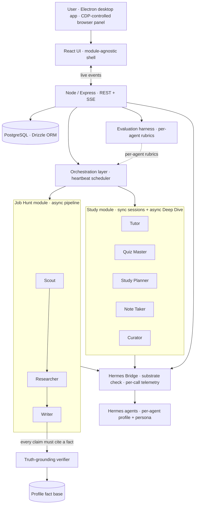

# Fluid

**A desktop AI agent platform built to answer the questions every "AI agents" demo dodges: how do you know they're any good, how do you stop them lying, and what happens when they fail at 2 AM.**


A portfolio project by [Christin Thomas](https://www.linkedin.com/in/0chris) — an AI Product Manager who specs *and* ships. I PM by writing the roadmap, the technical specs, and (with AI agents in the loop) the code. About 70% of the decisions in this repo are mine end-to-end: what to build, what *not* to build, how the agents are constrained, how the failures get classified, when to stop shipping features and harden instead.

---

## TL;DR

- **Two live modules on one runtime.** **Job Hunt** (3 agents · 5-stage pipeline) and **Study** (5 agents · FSRS-6 spaced repetition · sync sessions and async Deep Dive) share a single orchestration layer, eval harness, and reliability backbone. Same shell, different domain — the platform thesis tested in production.
- **Built for trust, not demos.** A deterministic truth-grounding verifier blocks fabricated claims before they leave the app. An evaluation harness scores every agent against per-role rubrics with separate **graded** and **guardrail** dimensions, plus N-iteration averaging so a lucky single run can't mask flaky behaviour.
- **A continuously-maintained issue tracker, not a retrospective.** 108 file-based issues, 19 ship sessions, severity-graded, auto-rolled-up. Every fix lands with an issue ID; the backlog itself is an artifact.
- **Hardened the way real products are.** After the first feature push I gated all new work behind a **three-sprint stabilization plan** — 80 issues triaged, 39 fixed, all 15 Highs closed — before shipping anything else.
- **Says no in writing.** Cloud Readiness, multi-tenancy, six Sprint-4 polish items, and 10 of 11 registered adapter integrations are all **explicitly parked** behind a stated gate. The reasons are in [`docs/roadmap.md`](docs/roadmap.md). Saying no on the record is the PM-iest thing in this repo.

---

## What it is



Two execution paths sit under one UI shell — a real design choice:

- **Async / heartbeat** — Job Hunt, Meetings, Study content import + Deep Dive, the Study Curator. Work becomes a tracked issue; the heartbeat scheduler wakes the right agent; a bridge service lenient-parses output back into domain tables. This is where the truth verifier runs.
- **Sync** — Study Tutor sessions and Quiz Me. An awaited Hermes turn through a concurrency semaphore; no issue, no scheduler. The student is sitting in front of the conversation; latency is the product.

Keeping these explicitly separate — rather than forcing one path to serve both — was the architectural decision that made Study tractable on the Job Hunt shell.

---

## How I prioritize

Three axes. Anything that scores on at least one stays on the list; anything that scores on none goes in `docs/roadmap.md` under **Parked** with the reason written down.

1. **Does it deepen an existing module's viability?** Not "another feature" — does the user *come back tomorrow* because of this? Curator (the v2 fifth Study agent) scored here: without it, Day 0 of a new course is a blank chat.
2. **Does it remove a known landmine?** The reliability sprints scored almost exclusively here. So does the Hermes Bridge — a quiet dependency that degrades silently is a worse problem than a missing feature.
3. **Does it produce a defensible interview moment?** Honest framing: this is a portfolio. The Hermes Health page (substrate status, per-call telemetry, cost-source integrity) was greenlit partly because *"Fluid watches its own substrate and tells you when something's off"* reads convincingly to a non-engineer.

Things that score on none — Cloud Readiness, multi-tenancy UI, macOS code signing, the other 10 adapter integrations — are parked, on the record, with the trigger condition for un-parking written next to them.

---

## The docs

- **[docs/decisions.md](docs/decisions.md)** — the six product decisions that actually defined Fluid: approval gates over autonomy, hard-rule score caps, roles + boundaries over one super-agent, deterministic truth-grounding, the cross-opportunity learning loop, and the module abstraction proven by Study.
- **[docs/roadmap.md](docs/roadmap.md)** — what's shipped, what's shipping now, **what's parked and why** (the most PM-signal-rich doc in the repo), and what's queued for after the commercial-viability gate clears.
- **[docs/agents.md](docs/agents.md)** — per-agent persona deep-dive: scope, tools, accuracy mechanisms, why each one is the way it is. Plus the evaluation harness that grades them.
- **[docs/reliability.md](docs/reliability.md)** — the three-sprint hardening plan, the five most instructive incidents, and the ongoing rolling-hardening backlog. *Most of what this section is about is what changed because of what broke.*

---

## Tech stack

| Layer | Choice |
|---|---|
| Desktop shell | Electron — embeds compiled server + built UI; CDP-controlled browser panel on port 9223 with collapsible split-view for user takeover |
| Frontend | React 19, Vite, Tailwind, shadcn/ui; deep-linked routes; SSE live events with polling fallback; keyboard shortcuts; design-tokens-only color and typography |
| Backend | Node.js, Express, SSE; PostgreSQL + Drizzle ORM with explicit migrations (`0090`–`0108`) |
| Agent runtime | Hermes agents (local CLI) with per-agent profile directories under `~/.hermes/profiles/`; persona injection via per-profile `SOUL.md`; substrate verified at boot by the in-house Hermes Bridge |
| Models | Job Hunt agents on `MiniMax-M2.7`; Study v2 wired per-agent (Tutor: Nemotron 3 Super 120B; Quiz Master: Arcee Trinity Large Thinking; Study Planner: DeepSeek V4 Flash; Curator + Note Taker: MiniMax-M2.7) — all via OpenRouter free tier |
| Study-specific | FSRS-6 spaced repetition (`ts-fsrs`) with per-student weight optimization (Python subprocess); sync sessions through a concurrency semaphore |
| Integrations | Gmail draft creation for outreach + follow-ups; iCalendar export for interviews; Chrome extension for one-click LinkedIn / Indeed / Wellfound capture |

---

## Working in the open

The internal `building_documents/` tree is the PM workspace:

```
building_documents/
  README.md              ← Current State (always-current)
  product/               ← PRDs · feature specs · positioning
  technical/             ← architecture · patches · known bugs
  ui/                    ← UI specs and component guides
  agent_config/          ← per-agent persona definitions
  roadmap/               ← shipped · in progress · parked · future
  Issue_Tracking/        ← 108 file-based issues · 19 sessions
    issues/ISS-NNN.md    ← frontmatter (severity · status · area) + body
    sessions/S-NN.md     ← what shipped this session
    ISSUE_LOG.md         ← auto-generated rollup
    SESSION_LOG.md       ← auto-generated rollup
```

Every fix lands with an issue ID. Every doc is reconciled against the codebase after a feature lands. The tracker rolls itself up: `pnpm bugs:build` regenerates the JSON the in-app **Known Bugs** tab serves. Pre-commit hook keeps the rollups honest.

This is what I mean by *PM-Dev*: the spec, the code, the bug, and the close-out are one continuous loop maintained by one person.

---

## Screenshots

| Pipeline dashboard | Opportunity detail | Evaluation report |
|---|---|---|
|  |  |  |

| Truth-grounding verifier | Profile fact base | Hermes Health |
|---|---|---|
|  |  | *(coming next update)* |

*Study module screenshots and a walkthrough video in the next update.*

---

## About

I'm **Christin Thomas** — an AI / Agents PM who ships. The code is private; this page (and the linked docs) is the living overview of what's built, what's not, and why.

If you're hiring for an AI / Agents / Platform PM role and want a code-and-decisions walkthrough — **[LinkedIn](https://www.linkedin.com/in/0chris)** is the fastest way to reach me.
